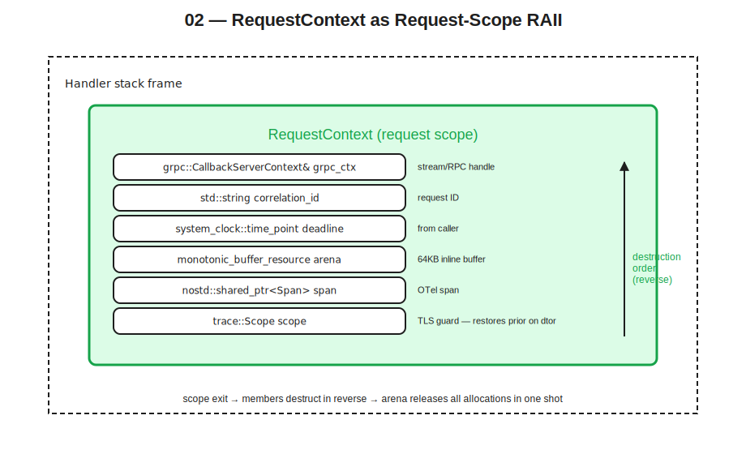

# 02 — RAII as the Foundation for Safe Stateful Work in a Stateless Service



## Thesis

A stateless service still has plenty of state — just not the kind that survives a request. Inside a single request handler, the service routinely holds: a parsed request message, intermediate computations, a span context for tracing, a deadline, a checked-out database connection, perhaps a per-request memory arena, locks acquired and released, and a half-built response. All of this is state. None of it should outlive the request.

The C++ mechanism for making "doesn't outlive the request" structurally true is RAII — Resource Acquisition Is Initialization. Resources are wrapped in objects whose constructors acquire and whose destructors release. Object lifetimes are bound to scope. When a scope exits — normally or via exception — destructors run in reverse construction order, releasing everything. The discipline is to make the conceptual boundary (request, RPC, transaction, span) match a C++ scope, and to put all per-request state inside RAII types whose lifetimes coincide with that scope.

Done well, this gives both correctness — no resource leaks, no stale state crossing into the next request — and performance — deterministic destruction at well-defined points, no GC pauses, no fragmented cleanup. Done badly — manual cleanup, raw pointers, throwing destructors, locks held across `co_await` — and the service slowly leaks resources, holds shared state across requests, and surfaces correctness bugs that look random.

This document covers the RAII discipline for a stateless service: how to model request-scoped state as RAII types, the canonical gRPC pattern, the common mistakes, the counterexample of manual cleanup that goes wrong, and the performance angle the project brief specifically asked for — how the constants of construction and destruction matter in a hot path.

## A refresher on the three guarantees

The C++ exception-safety vocabulary distinguishes three levels.

The **basic guarantee** says that on exception, no resources leak and the program remains in a valid state. The state may differ from before the operation, but no invariants are broken.

The **strong guarantee** says that on exception, the program state is exactly as it was before the operation. Transactional.

The **no-throw guarantee** says the operation does not throw. Destructors must offer this; move operations should where possible.

In a request handler, the practical target is the basic guarantee everywhere, the strong guarantee on operations that mutate authoritative external state (database writes, cache updates other replicas observe), and the no-throw guarantee on destructors and on move operations of types stored in standard containers.

> **Opinion.** A handler that doesn't think clearly about which guarantee it offers will accidentally offer "none." Pick one explicitly per operation, and let the type system enforce it. Most handlers can target the basic guarantee throughout; reach for the strong guarantee only where authoritative external state is being changed.

RAII gives the basic guarantee for free: any resource owned by an RAII object is released on scope exit, exception or not. The strong guarantee requires more — typically a copy-then-swap pattern or transactional database semantics. The no-throw guarantee for destructors is essentially required by the language: if a destructor throws while another exception is propagating, `std::terminate` is called and the process dies.

## The gRPC request boundary

Modern gRPC C++ code uses the callback API, recommended for new work over the legacy completion-queue async API. Each inbound RPC enters the server's thread pool with a `CallbackServerContext*` and pointers to the request and response messages. The `CallbackServerContext` is a per-request RAII container created by the gRPC runtime and destroyed when the reactor calls `Finish()` for a unary call, or when the reactor's own lifetime ends for streaming calls.

```cpp
grpc::ServerUnaryReactor* MyService::DoWork(
    grpc::CallbackServerContext* ctx,
    const work::Request* req,
    work::Response* resp) {

    // ctx, req, resp are all request-scoped — destroyed when the
    // reactor finishes. Any state we construct on the stack from
    // here is also request-scoped, automatically.

    auto* reactor = ctx->DefaultReactor();
    // ... do the work, populate resp ...
    reactor->Finish(grpc::Status::OK);
    return reactor;
}
```

The handler's stack frame defines the request scope. Locals constructed on it are destroyed in reverse order when the handler returns. This is the C++ scope that should hold every per-request resource: span, arena, DB transaction, deadline, response builder. Get this right and the rest of the discipline follows.

A subtlety with the callback API: the handler returns the reactor pointer and the actual reply work may continue asynchronously, especially for streaming. If state must outlive the handler's return — typical for streaming reactors — that state is owned by the reactor object, and the reactor itself is request-scoped (gRPC destroys it when streaming completes). The principle is the same: state has a defined lifetime bound to the request, just one level out.

## The `RequestContext` pattern

Many handlers benefit from a single RAII type that bundles per-request state, passed by reference through the call graph. A skeleton in C++20:

```cpp
#include <array>
#include <chrono>
#include <cstddef>
#include <memory_resource>
#include <string>

#include <grpcpp/grpcpp.h>
#include <opentelemetry/trace/provider.h>
#include <opentelemetry/trace/scope.h>

namespace otel = opentelemetry;

class RequestContext {
public:
    RequestContext(grpc::CallbackServerContext& grpc_ctx,
                   std::string correlation_id)
        : grpc_ctx_{grpc_ctx},
          correlation_id_{std::move(correlation_id)},
          deadline_{grpc_ctx.deadline()},
          arena_buffer_{},
          arena_{arena_buffer_.data(), arena_buffer_.size()},
          span_{tracer().StartSpan("handle_request")},
          scope_{tracer().WithActiveSpan(span_)} {
        span_->SetAttribute("correlation_id", correlation_id_);
    }

    // Non-copyable, non-movable: lifetime tied to handler's stack frame.
    RequestContext(const RequestContext&)            = delete;
    RequestContext& operator=(const RequestContext&) = delete;
    RequestContext(RequestContext&&)                 = delete;
    RequestContext& operator=(RequestContext&&)      = delete;

    ~RequestContext() noexcept = default;  // members destroy in reverse order

    std::pmr::memory_resource* arena()           noexcept { return &arena_; }
    std::chrono::system_clock::time_point deadline() const noexcept {
        return deadline_;
    }
    const std::string& correlation_id() const noexcept {
        return correlation_id_;
    }
    bool cancelled() const noexcept { return grpc_ctx_.IsCancelled(); }

private:
    grpc::CallbackServerContext&             grpc_ctx_;
    std::string                              correlation_id_;
    std::chrono::system_clock::time_point    deadline_;
    std::array<std::byte, 64 * 1024>         arena_buffer_;
    std::pmr::monotonic_buffer_resource      arena_;
    otel::nostd::shared_ptr<otel::trace::Span> span_;
    otel::trace::Scope                       scope_;

    // Process-scoped tracer, returned from a function-local static
    // or constructed in main() and accessed via a passed-in reference.
    static otel::trace::Tracer& tracer();
};
```

A handler that uses it:

```cpp
grpc::ServerUnaryReactor* MyService::Compute(
    grpc::CallbackServerContext* ctx,
    const compute::Request* req,
    compute::Response* resp) {

    RequestContext rc{*ctx, req->correlation_id()};

    // Per-request scratch space using the arena (covered in detail in Doc 03)
    std::pmr::vector<std::pmr::string> tokens{rc.arena()};
    tokens.reserve(req->inputs_size());
    for (const auto& in : req->inputs()) {
        tokens.emplace_back(in, rc.arena());
    }

    // ... do work, populate resp ...

    auto* reactor = ctx->DefaultReactor();
    reactor->Finish(grpc::Status::OK);
    return reactor;
    // rc destructs here: the OTel scope clears active-span TLS,
    // the span ends, the arena releases all allocations,
    // and the rest of the context falls away — all in reverse order.
}
```

Members are listed in initialization order; destructors run in reverse. That is exactly what we want here: the OTel scope clears first (restoring the prior active-span TLS), then the span ends, then the arena releases all allocations in one shot, then the rest of the context falls away. There is no manual cleanup. Adding a new per-request resource means adding a new RAII member; the destruction order falls out automatically.

> **Opinion.** Make `RequestContext` non-copyable and non-movable. Pass it by mutable reference into the call graph. Resist the temptation to make it `std::shared_ptr<RequestContext>` for "convenience" — that opens the door to lifetime extending past the handler scope, which defeats the whole point of binding state to request scope.

## Common mistakes

A handful of recurring mistakes are particularly costly in a service context.

**Throwing destructors.** The C++ standard makes destructors implicitly `noexcept` since C++11, but it's still possible to mark one as throwing or to call a throwing function from inside one. If a destructor throws while another exception is propagating, `std::terminate` runs and the process dies. In a request handler that means a single misbehaving destructor crashes the OS container and takes every in-flight request down with it. Mark destructors `noexcept` explicitly when there's any possibility of accidentally throwing, and prefer to log-and-swallow inside destructors rather than propagate.

**Raw `new`/`delete` for per-request resources.** Once you write `auto* x = new Thing(...)`, you have committed to either tracking every exit path and calling `delete` on each, or wrapping it in a smart pointer immediately. The latter is almost always right. `std::unique_ptr<Thing>` with a custom deleter for non-`delete`-cleanable resources is the workhorse.

**Locks held across `co_await`.** A coroutine that holds a `std::unique_lock<std::mutex>` and then suspends on `co_await` may resume on a different thread. The lock was acquired by thread A; when the coroutine resumes on thread B, the lock is now held by a thread that didn't acquire it. This is undefined behaviour with most mutex implementations. Mitigations: use a coroutine-aware async mutex (several libraries provide one, including Boost.Asio's experimental channel-based primitives), or structure the work so that the lock is released before `co_await` and re-acquired after. Doc 05 develops this further alongside the broader threading model.

**Manual try/catch cleanup paths.** Code that looks like this:

```cpp
auto* conn = pool.acquire();
try {
    auto result = conn->query(...);
    cache.update(...);
    pool.release(conn);
    return result;
} catch (...) {
    pool.release(conn);
    throw;
}
```

is RAII-shaped already; the fix is to make `pool.acquire()` return a `ScopedConnection` whose destructor releases:

```cpp
auto conn = pool.acquire();         // returns a ScopedConnection
auto result = conn->query(...);
cache.update(...);
return result;                      // ScopedConnection destructs on return
```

The mechanical pattern is: every resource has an owning RAII type; acquisition is via constructor or named factory that returns the owning type; release is via destructor. No `try`/`catch` for cleanup, only for error handling.

**Forgetting `noexcept` on move operations.** Standard containers like `std::vector` examine `std::is_nothrow_move_constructible_v<T>` to decide whether to move or copy on reallocation. If `T`'s move constructor is not `noexcept`, the vector copies on reallocation — a silent and substantial performance loss. Mark move constructors and move assignment `noexcept` unless they genuinely can throw.

## A counterexample worth recognizing

The kind of code that gets written under deadline pressure:

```cpp
// Anti-pattern: manual cleanup, easy to get wrong under maintenance.

grpc::Status FetchAndStore(const Request* req, Response* resp) {
    Connection* db    = nullptr;
    Connection* cache = nullptr;
    grpc::Status status = grpc::Status::OK;

    db = db_pool_.acquire();
    if (!db) {
        return grpc::Status{grpc::StatusCode::UNAVAILABLE, "db pool exhausted"};
    }

    cache = cache_pool_.acquire();
    if (!cache) {
        db_pool_.release(db);  // (1) easy to forget on later edits
        return grpc::Status{grpc::StatusCode::UNAVAILABLE, "cache pool exhausted"};
    }

    try {
        const auto value = db->query(req->key());  // may throw
        cache->set(req->key(), value);             // may throw
        resp->set_value(value);
    } catch (const std::exception& e) {
        status = grpc::Status{grpc::StatusCode::INTERNAL, e.what()};
    }

    cache_pool_.release(cache);  // (2) order matters
    db_pool_.release(db);        // (3) order matters
    return status;
}
```

Three things wrong here. First, the early-return after (1) is the kind of thing a maintenance reviewer might add to handle a new error case and then forget to add the cleanup for. Second, the resource release ordering at (2)/(3) is implicit in the code and easy to invert during refactoring. Third, any new exception added inside the `try` block requires verifying that both pools get released — and if a future maintainer adds a `return` inside the `try`, both releases are skipped entirely.

The RAII version is shorter and structurally cannot leak:

```cpp
grpc::Status FetchAndStore(const Request* req, Response* resp) {
    auto db    = db_pool_.acquire();     // RAII: returns ScopedConnection
    auto cache = cache_pool_.acquire();
    if (!db) {
        return grpc::Status{grpc::StatusCode::UNAVAILABLE, "db pool"};
    }
    if (!cache) {
        return grpc::Status{grpc::StatusCode::UNAVAILABLE, "cache pool"};
        // db destructs here, returning to its pool
    }

    try {
        const auto value = db->query(req->key());
        cache->set(req->key(), value);
        resp->set_value(value);
    } catch (const std::exception& e) {
        return grpc::Status{grpc::StatusCode::INTERNAL, e.what()};
        // cache destructs first, then db
    }
    return grpc::Status::OK;
    // cache destructs first, then db — both release to their pools
    // regardless of whether we returned via error, exception, or normal path.
}
```

The shape of the fix is always the same: replace owning raw pointers with owning RAII types, and let the compiler handle cleanup. Doc 07 covers the connection-pool `ScopedConnection` implementation in detail, including the question of what to do when the connection is in an unusable state at release time (mark it invalid rather than return it to the pool).

## The performance side of RAII

RAII is correctness machinery, but in a hot path running billions of times the constants of construction and destruction matter. Five points are worth knowing concretely.

**Constructor cost is dominated by allocation.** A `std::string` constructed in a handler from a `std::string_view` requires a heap allocation unless the result is small enough to live in the string's small-buffer optimization region — typically up to 15 bytes on libstdc++, 22 on libc++ (implementation-defined; check your toolchain). For a handler that builds many short strings, SBO is a major silent optimization. For a handler that builds long strings, every construction is a malloc call: lock contention in the glibc arena, possible page faults on fresh pages, fragmentation across thread arenas. Mitigations are PMR allocators backed by a per-request arena (Doc 03), `reserve()` on `std::vector` and `std::string` to known caps, and `std::span`/`std::string_view` where ownership isn't actually needed.

**Destructor cost is asymmetric across allocator strategies.** A `std::unordered_map<K, V>` with N entries destroys each entry individually — N destructors, N deallocations, N pointer chases through the hash buckets. A `std::pmr::unordered_map<K, V>` backed by a `monotonic_buffer_resource` destroys each entry's destructor *and* a no-op deallocate (the arena reclaims everything in one shot when it dies). For trivially destructible value types, the per-entry destructor compiles out entirely, leaving just the arena release. This is the most concrete reason PMR pays off in handlers that build large transient structures: not the allocation savings, but the destruction-time collapse from O(N) to O(1).

**`noexcept` on moves is not optional.** `std::vector` reallocates by examining `std::is_nothrow_move_constructible_v<T>`. If true, it moves; if false, it copies. A type with an unmarked move loses move semantics inside `std::vector`. For per-request scratch types (request models, intermediate result structs, error contexts), making move ops `noexcept` is essentially mandatory for performance under reallocation. The same gotcha applies to `std::deque` (less commonly) and to algorithms that internally relocate via `std::move_if_noexcept`.

**Trivial destructibility compiles to nothing.** A type satisfying `std::is_trivially_destructible_v<T>` has its destructor optimized out entirely. Aggregates of trivial types — POD-style request models — get this for free. Adding a `std::string` member loses it; adding a `std::unique_ptr<T>` member loses it. For per-request scratch structures, prefer designs that stay trivially destructible where possible: use `std::span` views into the arena instead of `std::string` copies, use index handles into arena-backed vectors instead of pointers.

**Allocator awareness is a per-type choice.** Default-allocator `std::string` and `std::vector` in a handler hit the global heap, which means lock contention in the malloc arena, fragmentation across thread arenas, and unpredictable tail latency from page faults and arena rebalancing. Allocator-aware variants (PMR or custom) move the allocation budget into a place you can reason about per request. The choice is per-type and per-call-site: a long-lived `std::string` in a process-scoped cache map doesn't need PMR; a transient `std::string` in a handler does.

> **Opinion.** The single most useful refactor in a hot-path handler is: identify the largest transient structure, replace its default allocator with a PMR one backed by the request arena, and measure. The result is usually a measurable P99 improvement and a quieter heap profile. Doc 03 develops the technique end-to-end.

## C++23 improvements worth noting

Two C++23 additions specifically improve the RAII discipline in a service.

`std::expected<T, E>` gives a value-or-error return type without exceptions. For handler-internal flow where errors are expected — validation failures, cache misses, retryable timeouts — this composes more cleanly than exception unwinding and is friendlier to the cost model of RAII destruction. The exception path still exists for genuinely exceptional cases (OOM, programmer errors); `std::expected` is for the common-but-failing path.

```cpp
std::expected<UserProfile, ErrorCode>
fetch_user(const RequestContext& rc, std::string_view user_id) {
    auto conn = pool_.acquire(rc.deadline());
    if (!conn) return std::unexpected{ErrorCode::PoolExhausted};
    auto row = conn->fetch_one(query_, user_id);
    if (!row) return std::unexpected{ErrorCode::UserNotFound};
    return parse_user(*row, rc.arena());
}
```

The handler dispatches on the `std::expected` without a `try`/`catch`, and the RAII destruction of `conn` (release to pool) happens identically on both branches.

`std::pmr::stacktrace` provides a stacktrace whose internal storage is PMR-allocated. Captured in a per-request handler with the request arena as the resource, a stacktrace at the point of an error costs nothing extra to clean up — it dies with the arena. For services that capture stacks on errors for telemetry (sending them to Tempo or as span attributes), this keeps even the diagnostic path arena-local.

Both features are available in GCC 14 and Clang 18 with libc++; Doc 11 covers the build-tooling specifics for enabling them under Conan and CMake.

## Recommendation summary

Every per-request resource gets an RAII owner. No raw `new`/`delete`. No raw `pool.acquire()`/`pool.release()`. No `try`/`catch` for cleanup — only for error handling.

Bundle per-request state into a `RequestContext`-like type whose destruction order matches the conceptual unwind order: TLS scopes first, then spans, then arena, then everything else.

Mark destructors `noexcept` — which is the default, but the explicit marker documents intent. Mark move constructors and move assignment `noexcept` unless they genuinely throw. The cost of getting this wrong is silent copy fallback in standard containers, which is hard to spot in code review and easy to see in a flamegraph.

Prefer trivially destructible types for per-request scratch. Use `std::span` and `std::string_view` into arena-backed storage instead of copies where ownership isn't needed.

When a handler builds a large transient structure (parsed input, intermediate results, a lookup map), allocate it via PMR with the request arena as the resource. The destruction asymmetry is the win, not the allocation speed.

Reach for `std::expected<T, E>` (C++23) for the expected-failure paths inside a handler; keep exceptions for genuinely exceptional cases.

## Cross-references

Doc 03 develops the PMR pattern specifically — `monotonic_buffer_resource`, layered pool resources, per-handler arenas, and the `std::` container choices that work well over them.

Doc 04 covers process-scoped state and how its lifetime differs from request-scoped state — the State Architecture Table makes the distinction explicit and shows what belongs in each column.

Doc 05 covers threading and the `thread_local`-is-process-scope trap, which interacts with the RAII discipline: a TLS guard is itself an RAII type, but its scope is the handler, not the thread.

Doc 07 covers state externalization and the `ScopedConnection` RAII pattern for connection-pool checkout, referenced in the counterexample above.

Doc 10 (gRPC microservices) shows the `RequestContext` and friends wired into a complete callback-API service skeleton.

## Annotated bibliography

**Iglberger, *C++ Software Design*.** The chapters on value semantics, on ownership, and on the strategy pattern are directly relevant. The Strategy chapter is particularly useful for understanding how RAII types compose — a resource type plus its release strategy, separated cleanly. The dependency-injection chapter applies to how `RequestContext` and similar types are constructed and passed through the call graph rather than reached for via global state.

**Yonts, *100 C++ Mistakes and How to Avoid Them*.** The cluster of mistakes around throwing destructors, raw `new`/`delete`, manual cleanup paths, missing `noexcept` on moves, and exception safety in general directly informs the "common mistakes" section above. Useful as a code-review checklist for any handler under review.

**"C++ High Performance" (2nd edition).** The RAII chapter and the chapter on move semantics cover the constructor/destructor cost angle in depth, with measurements. The chapter on memory layout is the entry point for the PMR work in Doc 03.

**Enberg, *Latency*.** The framing of destructor cost asymmetry as a tail-latency consideration comes from here; the book is also useful for the broader question of where deterministic cleanup matters most.

**Geewax, *API Design Patterns*.** The chapter on idempotency and the chapters on standard error responses are relevant to the `std::expected` discussion above — what to return on the failing path is an API design question as much as a C++ one.

**"Building Low Latency Applications with C++".** Background reference for the cost model of standard-library operations under load; cited more directly in Doc 05 (threading) and Doc 07 (state externalization).
