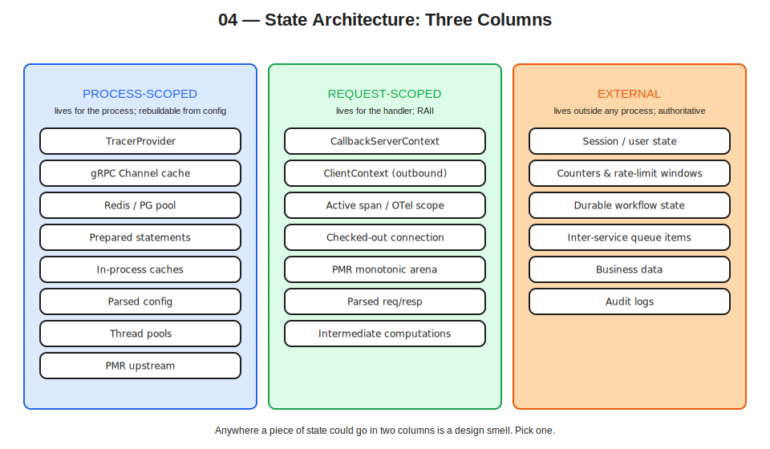

# 04 — Process-Scoped State That's Still Stateless from the Orchestrator's View



## Thesis

A stateless service is not a stateless process. The prior documents have been careful with the distinction: request-scoped state lives and dies inside a handler (Doc 02), often inside a per-request arena (Doc 03). Process-scoped state lives for the lifetime of the OS container, accumulates over many requests, and dies cleanly on cold start. The orchestrator does not care about process-scoped state — it cares about whether the service can be killed and replaced without correctness loss. As long as process-scoped state is *rebuildable from configuration on cold start*, the service is stateless from the orchestrator's view, regardless of how much memory the process is holding.

The mental error to avoid is the C++ developer's instinct to treat any persistent in-process state as "stateful." A gRPC channel cache, a Redis connection pool, an OpenTelemetry `TracerProvider`, a parsed-once configuration object — all live for the process lifetime, all are legitimate, and none make the service stateful in the cloud-native sense. The right framing is: process-scoped state is *expensive to rebuild*, not *needs to be replicated or persisted*. Confusing these two — putting authoritative session data in a `static` map because it's faster than Redis — is one of the most common architectural mistakes when moving a C++ codebase from monolith to containers.

This document covers process-scoped state: what belongs there, what doesn't, the State Architecture Table that anchors the distinction across the doc set, how to wire process-scoped state in `main()` rather than reaching for singletons, and how to size it against the OS container's memory and ephemeral-storage budget. CPU limits get a sizing-budget mention here; the threading-correctness consequences are Doc 05's subject.

## Categories of process-scoped state

A typical C++ microservice in this stack carries several kinds of process-scoped state.

The **OpenTelemetry `TracerProvider`** is the canonical singleton in modern service code. It owns the span exporter (sending spans to Tempo or another OTLP backend), the span processor (batching, typically), the sampler, and the resource attributes that identify this instance. Constructed once at startup, used by every handler via `opentelemetry::trace::Provider::GetTracerProvider()`.

**gRPC channels** are objects representing a long-lived connection (more precisely, a managed set of HTTP/2 connections) to a remote service. Channel construction is expensive — name resolution, TCP/TLS handshake, HTTP/2 settings exchange. Reusing channels across many RPCs is essential. Most services maintain a process-scoped cache of channels keyed by `(target, options)` tuple.

**Connection pools to backing services** — Redis via `redis-plus-plus`, PostgreSQL via `libpqxx` plus user-written pooling or a third-party pooler — own a set of long-lived connections, hand them out via RAII checkout, validate them periodically, replace dead ones. Sizing depends on workload and on the memory budget; checkout latency depends on contention.

**Prepared statement caches** are typically attached to a database connection or to the pool. The first execution of a query plans it; subsequent executions reuse the plan. The cache is process-scoped (per-connection or per-pool) and bounded in size.

**PMR upstream resources** are the heap source for per-request arenas that overflow their inline buffers (Doc 03). A single process-scoped `std::pmr::synchronized_pool_resource`, backed by the global allocator, is a reasonable default; sizing matters for memory-tight services.

**Best-effort in-process caches** sit in front of external lookups for performance — short-TTL caches of frequently-accessed data, computed-once expensive results. They miss to an authoritative external store on cache miss or eviction (Doc 07 covers the externalization pattern). They are *never* the authoritative source.

**Parsed configuration** is the result of reading environment variables, command-line flags, and config files at startup. It lives for the process lifetime, immutable after construction. Doc 06 covers configuration philosophy.

**JIT-compiled regexes, parsed Lua scripts, machine-learning model weights loaded from disk** — anything that takes significant time to construct and never changes once built — belongs here too.

## The State Architecture Table

The single most useful artifact in this doc set; referenced from several others.

| State type | Process-scoped | Request-scoped |
|---|:---:|:---:|
| OpenTelemetry `TracerProvider` | ✓ | — |
| OpenTelemetry `Tracer` (per library) | ✓ | — |
| Active span / span context | — | ✓ |
| gRPC `Channel` cache | ✓ | — |
| gRPC `ClientContext` (per outbound RPC) | — | ✓ |
| gRPC `CallbackServerContext` (per inbound RPC) | — | ✓ |
| Redis / PostgreSQL connection pool | ✓ | — |
| Single pooled connection (checked out) | — | ✓ (RAII) |
| Prepared-statement cache | ✓ | — |
| In-process best-effort cache | ✓ | — |
| Parsed configuration | ✓ | — |
| PMR upstream resource (heap, pool) | ✓ | — |
| PMR `monotonic_buffer_resource` arena | — | ✓ |
| Per-request parsed request / response | — | ✓ |
| Per-request intermediate computations | — | ✓ |
| Authoritative session / user state | — | — (external) |
| User-visible counters, rate-limit windows | — | — (external) |

Two rows worth dwelling on. The fourth from the bottom — "Authoritative session / user state" — has no check in either column. It belongs in *external* state (Redis, PostgreSQL, Kafka) because the service is stateless: data that clients depend on cannot live in any single replica. Doc 07 develops the externalization pattern. The same is true of user-visible counters and rate-limit windows — they have to be consistent across replicas, which means they live in a shared store.

> **Opinion.** When you find yourself wanting to put something in the "process-scoped" column because it's faster than externalizing, ask: does the next request need to see this? If yes, it has to be externalized regardless of cost. If no — best-effort cache, computed-once derived value, parsed config — then process-scoped is fine. The performance answer is almost never to ignore the architectural constraint.

## Wiring process-scoped state in `main()`

The C++ instinct for "one of these per process" is the singleton pattern — typically a Meyers singleton with `static T& instance()`. This is wrong for service code, for reasons developed in detail in Doc 06. The short version: singletons hide construction order, conflate ownership with access, defeat testability, and make graceful shutdown harder. The replacement is plain construction in `main()`, with references passed down explicitly.

A skeleton wiring for a service that uses the OTel provider, a gRPC channel cache, and a Redis pool:

```cpp
#include <memory>
#include <chrono>

#include <opentelemetry/sdk/trace/tracer_provider_factory.h>
#include <opentelemetry/sdk/trace/batch_span_processor_factory.h>
#include <opentelemetry/exporters/otlp/otlp_grpc_exporter_factory.h>
#include <opentelemetry/trace/provider.h>
#include <grpcpp/grpcpp.h>
#include <sw/redis++/redis++.h>

namespace otel = opentelemetry;

int main(int argc, char** argv) {
    // 1. Parse configuration from env vars and flags (Doc 06).
    const Config config = parse_config(argc, argv);

    // 2. Construct the OTel TracerProvider. `provider` owns the SDK object;
    //    setting it on the global Provider exposes it to handlers.
    auto exporter  = otel::exporter::otlp::OtlpGrpcExporterFactory::Create(
        otlp_options_from(config));
    auto processor = otel::sdk::trace::BatchSpanProcessorFactory::Create(
        std::move(exporter), batch_options_from(config));
    std::shared_ptr<otel::trace::TracerProvider> provider =
        otel::sdk::trace::TracerProviderFactory::Create(
            std::move(processor), resource_from(config));
    otel::trace::Provider::SetTracerProvider(provider);

    // 3. Build the gRPC channel cache, keyed by target+credentials.
    ChannelCache channels{config.channel_options};

    // 4. Build the Redis pool with explicit size from config.
    sw::redis::ConnectionPoolOptions pool_opts;
    pool_opts.size                = config.redis_pool_size;
    pool_opts.wait_timeout        = std::chrono::milliseconds{50};
    pool_opts.connection_lifetime = std::chrono::minutes{30};
    sw::redis::Redis redis{config.redis_uri, pool_opts};

    // 5. Construct the service implementation with explicit dependencies.
    MyService service{channels, redis};

    // 6. Build the gRPC server.
    grpc::ServerBuilder builder;
    builder.AddListeningPort(config.listen_addr,
                             grpc::InsecureServerCredentials());
    builder.RegisterService(&service);
    grpc::EnableDefaultHealthCheckService(true);

    auto server = builder.BuildAndStart();

    // 7. Wait, then shut down cleanly (Doc 09 covers shutdown in detail).
    install_signal_handlers([&] {
        server->Shutdown(std::chrono::system_clock::now() +
                         std::chrono::seconds{30});
    });
    server->Wait();

    // 8. Force-flush the tracer so in-flight spans get exported.
    if (auto* sdk_provider =
            dynamic_cast<otel::sdk::trace::TracerProvider*>(provider.get())) {
        sdk_provider->ForceFlush(std::chrono::seconds{5});
    }
    otel::trace::Provider::SetTracerProvider({});
}
```

Every process-scoped object is constructed by name in `main()` and held by a local variable. Destruction order is reverse construction order — the server shuts down first (so no new RPCs arrive), then Redis pool, then channel cache, then the tracer provider flushes and clears. No `static T&` calls, no hidden construction order, no destruction-order surprises at process exit.

> **Opinion.** This is more verbose than a singleton-heavy alternative, and it is worth every line. The dependency graph is visible at the entry point. Test doubles inject the same way. Construction failures fail loudly at the place they happen instead of from a deep call stack the first time someone touches `Logger::instance()`.

Note that `MyService` receives `ChannelCache&` and `sw::redis::Redis&` as constructor parameters — dependency injection, not global lookup. Handlers reach for these through `MyService`'s members. The OTel `TracerProvider` is the one exception: it's set on the global `opentelemetry::trace::Provider` and accessed via `Provider::GetTracerProvider()` inside handlers, because that's the integration model OTel's API provides. It is still constructed and owned in `main()`; the global is the access mechanism, not the ownership.

## OS container resource limits — the budget

Process-scoped state has to fit inside an OS container's resource budget. The budget is set by the runtime: Podman `--memory` and `--cpus` flags, compose `deploy.resources.limits`, or Kubernetes `resources.limits`/`resources.requests` per container. Several C++-relevant points.

**Memory limits are hard.** Hit the limit and the OOM killer terminates the process — no graceful failure, no exception to catch, just SIGKILL. The kernel's view of the limit is precise; the C++ allocator's view is approximate. By the time `std::bad_alloc` would have been thrown, the kernel has often already killed the process. Mitigations are about sizing process-scoped state conservatively, leaving explicit headroom for transient request-scoped allocations, and treating the limit as an architectural constraint, not a runtime check.

**There is no `GOMEMLIMIT` for C++.** Go has runtime-level memory-limit awareness — it can read the cgroup limit and adjust GC behaviour to stay under it. C++ has no language-level equivalent. The closest is allocator-level: configure jemalloc, tcmalloc, or mimalloc to respect a soft cap, and instrument RSS via OTel metrics so dashboards alert before the kernel kills the process.

**CPU limits constrain throughput, not correctness.** A CPU limit means the kernel throttles the process when it exceeds the quota (the CFS quota / period mechanism). The process keeps running, just slower. From a state-sizing perspective the impact is indirect: under throttling, request latency spikes, in-flight requests queue, and memory pressure rises from the queue. Plan headroom. The thread-pool-sizing consequences are Doc 05's subject.

**Ephemeral-storage limits cap log volume.** Kubernetes `resources.limits.ephemeral-storage` caps the writable layer plus `emptyDir` plus container logs. A C++ service that writes verbose logs to stdout can blow this budget under unexpected load. Mitigations are structured log levels, rate-sampling noisy events, and aggressive shipping to Loki so logs don't accumulate locally. Doc 08 covers the ephemeral-storage angle in detail.

**Podman vs Kubernetes syntax.** Same semantics, different spellings.

| | Podman CLI | compose.yaml | Kubernetes |
|---|---|---|---|
| Memory limit | `--memory=256m` | `deploy.resources.limits.memory: 256M` | `resources.limits.memory: 256Mi` |
| CPU limit | `--cpus=0.5` | `deploy.resources.limits.cpus: "0.5"` | `resources.limits.cpu: "500m"` |
| Memory reservation | (none direct) | `deploy.resources.reservations.memory` | `resources.requests.memory` |
| CPU reservation | (none direct) | `deploy.resources.reservations.cpus` | `resources.requests.cpu` |
| Ephemeral storage | (no enforcement) | (no enforcement) | `resources.limits.ephemeral-storage` |

The "burstable" pattern — set requests but not limits — is widely used for latency-sensitive Kubernetes workloads. Podman has no direct equivalent; it's a single-host orchestration model where the limit is the only knob. For services that need to handle bursts without throttling, leaving CPU limits unset in Kubernetes is often the right answer.

## Sizing process-scoped state against the limit

A practical procedure for sizing in a memory-limited container.

Start with the budget. A `256Mi` memory limit minus roughly 30–50 MB of baseline (C++ runtime, gRPC, OTel SDK, allocator overhead) leaves around 200 MB for application state. Reserve another roughly 30% for request-scoped allocations (in-flight PMR arenas, per-request scratch). That leaves around 140 MB for process-scoped state.

Allocate the budget across the categories:

- **gRPC channels** are small in resident memory (a few hundred KB each) but hold open TCP/TLS connections with their own buffers. Budget around 1–2 MB per upstream. For a service talking to 10 upstreams, that's 10–20 MB.
- **Connection pools** for Redis or PostgreSQL: each pooled connection takes 1–4 MB depending on buffers. A pool of 20 connections budgets 20–80 MB. Tune the pool size to actual concurrency, not to maximum theoretical concurrency.
- **Prepared-statement cache** is typically a few KB per statement, bounded, rarely dominant.
- **In-process caches** are where most of the remaining budget goes, if you use them. Size in bytes, not entries — entries can have variable size, and a count limit is a poor proxy for memory pressure.
- **PMR upstream resource** backs arena overflow. Sizing depends on overflow rate; if the inline buffers are well-sized (Doc 03), the upstream sees little traffic.

The arithmetic is approximate, and the right answer is to instrument: export RSS, allocator stats, cache hit rates, and pool checkout latency as OTel metrics; alert on RSS approaching the limit; tune from observed behaviour.

## Bounded vs unbounded structures

The OOM-waiting-to-happen pattern is a process-scoped `std::unordered_map<K, V>` (or any other unbounded structure) that grows without an eviction policy. A small example:

```cpp
// Anti-pattern: process-scoped state that grows without bound.
class TokenCache {
public:
    void store(std::string token, UserInfo info) {
        std::lock_guard lock{mtx_};
        cache_.emplace(std::move(token), std::move(info));
        // No eviction. No size limit. Grows until OOM.
    }
    // ...
private:
    std::unordered_map<std::string, UserInfo> cache_;
    std::mutex                                mtx_;
};
```

Under normal traffic this looks fine — memory growth is slow, the OOM is months away, the service ships. Under abnormal traffic (a token-enumeration probe, a misbehaving client, a retry storm), the cache grows fast and the kernel kills the process. The fix is a bounded cache with explicit eviction:

```cpp
// Pattern: bounded cache with explicit byte budget.
class TokenCache {
public:
    explicit TokenCache(std::size_t max_bytes)
        : max_bytes_{max_bytes} {}

    void store(std::string token, UserInfo info) {
        const auto entry_bytes = approx_bytes(token, info);
        std::lock_guard lock{mtx_};
        bytes_used_ += entry_bytes;
        entries_.emplace_front(std::move(token), std::move(info), entry_bytes);
        while (bytes_used_ > max_bytes_ && !entries_.empty()) {
            bytes_used_ -= entries_.back().bytes;
            entries_.pop_back();
        }
    }
    // ...
private:
    struct Entry {
        std::string token;
        UserInfo    info;
        std::size_t bytes;
    };
    std::list<Entry>  entries_;     // for production: also keep an
    std::size_t       bytes_used_{0}; // unordered_map<token, list_iterator>
    std::size_t       max_bytes_;     // for O(1) lookup. Omitted for clarity.
    std::mutex        mtx_;
};
```

The point is not this specific implementation — production code reaches for a library (Abseil containers, a dedicated LRU library, or a fixed-size ring for the simplest case). The point is that *the byte budget is explicit*, declared at construction, and the cache stays under it regardless of input pattern.

> **Opinion.** Every unbounded structure in process-scoped state is a future OOM. Audit for them. The fix is rarely "make it bigger"; it is "give it an explicit byte budget and an eviction policy." Use the memory limit as the architectural ceiling; size individual structures as explicit fractions.

## `std::` container choices for process-scoped state

The choice rules from Doc 03 carry over with two modifications: process-scoped containers don't get the PMR arena treatment (they live for the process, not the request), and the choice criterion shifts from "what destroys cheaply" to "what gives bounded memory under workload."

For caches and lookup tables with small N (under ~64 entries), `std::flat_map<K, V>` (C++23) is usually best. Contiguous storage, cache-friendly, no per-entry allocation. The O(N) insertion cost matters only if the table churns; for steady-state lookups it's a clear win.

For larger N, `std::unordered_map<K, V>` is the standard answer. Per-entry node allocation, but the node allocator can be tuned, or replaced with a process-scoped pool resource that the map allocates from.

For density-sensitive workloads — caches where the per-entry overhead matters — third-party hash maps like `absl::flat_hash_map` or `absl::node_hash_map` give better density and often better performance. They're not in the standard, but they're well-tested and integrate cleanly with C++20 codebases via Conan.

For caches specifically, prefer libraries with explicit byte budgets over rolling your own on top of `unordered_map`. Implementations like `folly::EvictingCacheMap`, the various `lru_cache` libraries, or a small custom type behind a clean RAII interface are all reasonable. The criterion is that the size is bounded in bytes and the eviction policy is explicit.

For things that genuinely don't grow — prepared-statement caches with a known set, parsed configuration, channel caches keyed by a finite set of upstreams — a plain `std::unordered_map` is fine because the size is bounded by the input.

> **Opinion.** Pick the type based on the worst-case memory budget, not the typical-case access pattern. A cache that's "usually small" but unbounded is the same bug as one that's "definitely large" — both can be killed by an unexpected workload.

## CPU limits as a sizing consideration

A brief note that connects to Doc 05's deeper coverage. Process-scoped state sizing interacts with CPU limits in two ways.

First, thread pools are themselves process-scoped state, sized in part from the CPU budget. gRPC's internal pools, application worker pools, and allocator arenas all consume process memory proportional to their thread count. Sizing them too high wastes memory; sizing them too low underuses CPU. Doc 05 covers the sizing algorithm and the `std::thread::hardware_concurrency()` trap.

Second, throttling under CPU pressure raises memory pressure indirectly. When CFS throttles the process, in-flight requests queue, each holding a per-request arena. The queue depth multiplies the request-scoped memory footprint, which can push the process into the OOM zone. The mitigations are to bound queue depth (gRPC's `ServerBuilder::SetResourceQuota` and `MaxThreads` settings, an explicit semaphore in the handler), shed load early via `RESOURCE_EXHAUSTED` rather than queue indefinitely, and run with CPU headroom so throttling is rare.

The deep treatment of CPU limits — CFS quota mechanics, throttling tail latency, allocator arena configuration, the cgroup detection code — lives in Doc 05. From Doc 04's angle, CPU limits matter because they shape how much process-scoped concurrency you can afford to maintain.

## Recommendation summary

Treat process-scoped state as a first-class category. Construct it in `main()`, hold it by name, pass it to consumers by reference. Avoid Meyers singletons except for the OTel-style global-access hooks that the framework imposes.

Use the State Architecture Table as the design check: for every piece of state, ask which column it belongs in. Anything that doesn't fit in either is externalized.

Size process-scoped state against an explicit fraction of the OS container's memory limit. Reserve headroom for request-scoped allocations; instrument RSS, allocator stats, and pool checkout latency as OTel metrics.

Bound every growing structure. Caches get explicit byte budgets and eviction policies. Prepared-statement caches and channel caches are bounded by input but should still be capped defensively.

Prefer `std::flat_map` for small N, `std::unordered_map` for larger N, third-party density-optimized maps for cache hot paths, and dedicated LRU libraries for byte-budgeted caches.

Use Podman's `--memory` and `--cpus` flags, or compose `deploy.resources` blocks, during development. Kubernetes `resources.requests`/`resources.limits` are the production-side analogue; same semantics, different syntax.

## Cross-references

Doc 02 covers the RAII discipline for request-scoped state; this document is the complement on the process-scoped side. The two together exhaust the language-level state categories; anything else goes to external storage.

Doc 03 covers PMR for request-scoped arenas; the PMR upstream resource (process-scoped) is the heap source those arenas fall through to when their inline buffers overflow.

Doc 05 covers threading and concurrency, including the CPU-limit consequences for thread pool sizing, allocator arena counts, and the `std::thread::hardware_concurrency()` gotcha — the threading-specific complement to this document's memory-sizing focus.

Doc 06 develops the `main()`-owned wiring pattern further in the context of 12-factor configuration, and explains why the Meyers singleton is the wrong default for service code.

Doc 07 covers state externalization — the third column of the State Architecture Table, where authoritative state lives — and the `ScopedConnection` RAII pattern for checking pooled connections out of process-scoped pools.

Doc 08 covers the ephemeral-storage budget and why C++ services should write logs to stdout rather than to files.

Doc 09 covers graceful shutdown, including the destruction order for process-scoped state at process exit.

## Annotated bibliography

**Iglberger, *C++ Software Design*.** The chapters on dependency injection and on the strategy pattern frame the `main()`-owned wiring pattern. The Singleton chapter argues against Meyers singletons for service code on essentially the same grounds developed here.

**Geewax, *API Design Patterns*.** The chapter on resource lifecycle frames the externalization question (when does state belong outside the process), and the chapters on standard methods touch the bounded-vs-unbounded discussion around list endpoints and pagination.

**"C++ High Performance" (2nd edition).** The chapter on data structures discusses container choices in the context of cache friendliness and density, directly relevant to the process-scoped sizing question. The connection-management discussion in the network chapter is background for the channel cache and pool sections.

**Enberg, *Latency*.** The framing of latency under resource pressure, particularly the queueing-under-throttling pattern, informs the CPU/memory interaction discussion in this document.

**"Building Low Latency Applications with C++".** The chapters on memory layout and on long-lived process design are background for the broader question of how process-scoped state is laid out and accessed.

**Kubernetes documentation, "Resource Management for Pods and Containers" (`kubernetes.io/docs/concepts/configuration/manage-resources-containers/`).** The canonical reference for the `requests`/`limits` model. Worth reading once for the QoS-class semantics (BestEffort, Burstable, Guaranteed).

**Podman documentation on `--memory`, `--cpus`, and the compose `deploy.resources` block.** The single-host counterpart to the Kubernetes resource model.
