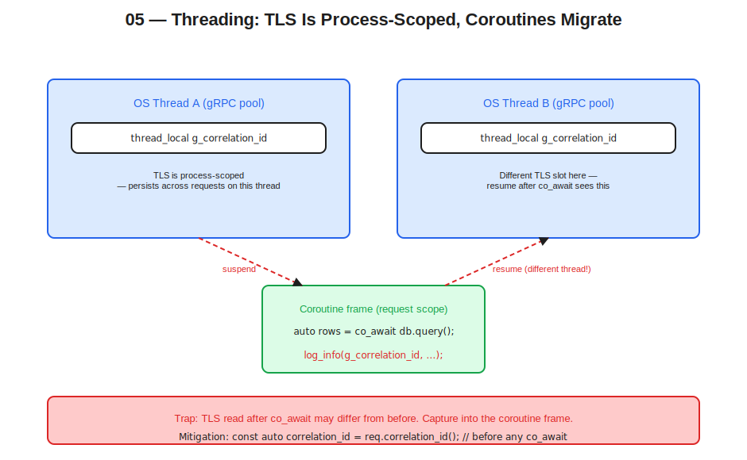

# 05 — Threading and Concurrency in a Stateless Service



## Thesis

Threading is the dimension of statelessness that catches C++ developers off-guard. Doc 04 covered process-scoped state and its memory budget; threading infrastructure — thread pools, executors, fiber schedulers, the allocator arenas underneath them — is part of that process-scoped state, but it interacts with the request/process boundary in ways that need their own treatment. Thread-local storage looks request-scoped and isn't. Stackless coroutines can resume on different threads than they started on, breaking TLS-based assumptions across `co_await`. gRPC's handler thread pool forbids blocking. OS container CPU limits constrain not just throughput but pool sizing, and `std::thread::hardware_concurrency()` will lie to you about what those limits are.

Doing concurrency correctly in a stateless service requires understanding which concurrency primitives carry which state across which scope, and arranging for that state to be either cleared at request boundaries or kept legitimately process-scoped. This document covers the operative cases: TLS as process-scoped state, the three concurrency families (OS threads, stackless coroutines, fibers) and their TLS interactions, the gRPC threading model, the CPU and memory limits that constrain everything, and the cooperative cancellation pattern that ties cleanup back to request scope.

## Thread-local storage is process-scoped, not request-scoped

The most common subtle bug at the threading-statelessness interface is treating `thread_local` storage as if it were request-local. It is not. In a thread-pool model — which is the standard service model — a thread handles many requests sequentially, and any `thread_local` variable persists across those requests. A `thread_local` correlation ID set in handler A and not cleared remains set for handler B that happens to land on the same thread.

```cpp
// Anti-pattern: thread_local that bleeds across requests.

thread_local std::string g_correlation_id;

grpc::ServerUnaryReactor* MyService::Handle(
    grpc::CallbackServerContext* ctx,
    const Request* req,
    Response* resp) {

    g_correlation_id = req->correlation_id();
    do_work();  // calls into logging, which reads g_correlation_id
    auto* r = ctx->DefaultReactor();
    r->Finish(grpc::Status::OK);
    return r;
    // g_correlation_id is now "leaked" — set to req->correlation_id(),
    // never cleared. Next request on this thread reads the stale value
    // until it happens to be overwritten.
}
```

The fix is an RAII guard that sets on construction and clears on destruction. This puts the TLS lifetime under request scope despite the storage itself being thread-scoped.

```cpp
class CorrelationGuard {
public:
    explicit CorrelationGuard(std::string id)
        : previous_{std::move(g_correlation_id)} {
        g_correlation_id = std::move(id);
    }
    ~CorrelationGuard() noexcept {
        g_correlation_id = std::move(previous_);
    }

    CorrelationGuard(const CorrelationGuard&)            = delete;
    CorrelationGuard& operator=(const CorrelationGuard&) = delete;
    CorrelationGuard(CorrelationGuard&&)                 = delete;
    CorrelationGuard& operator=(CorrelationGuard&&)      = delete;

private:
    std::string previous_;
};

// In the handler:
CorrelationGuard guard{req->correlation_id()};
do_work();
// guard destructs, restoring the prior value (typically empty).
```

The guard restores the previous value rather than clearing to empty. This composes correctly when handlers call into each other and when the same thread later runs unrelated background work. The pattern is well-established for any TLS-backed ambient context: span context, correlation IDs, MDC-style logging context, audit trails.

> **Opinion.** Anywhere a codebase uses `thread_local` for "the current X" — span, user, request, trace — there should be a corresponding RAII guard type. Bare `thread_local` writes are a code-review red flag; they imply someone is treating TLS as request-scoped storage, and the bug is usually one rotation away.

The OpenTelemetry C++ SDK uses TLS internally for the active span. This is a correct choice for the framework — span-context propagation needs ambient access — but it means user code interacting with OTel must respect the scope. The `opentelemetry::trace::Scope` type is a TLS guard: constructing one makes a span active, destructing one restores the previous active span. The `RequestContext` from Doc 02 holds a `Scope` member, so the active span clears automatically when the context destructs.

## Stack-based vs stackless concurrency

Three concurrency families show up in modern C++ service code, and they interact with TLS and request scope differently.

OS threads (`std::thread`, `std::jthread`) have their own kernel-managed stack — typically 1 MB on glibc, up to 8 MB on some platforms — and are scheduled by the kernel. Each thread has its own TLS storage. Threads are heavy to create and tear down, so the standard pattern is a thread pool constructed at startup. Within a thread, TLS is consistent: read a `thread_local` value, do work, read it again — same value (unless the work modified it).

Stackless coroutines (C++20 `co_await`) are compiler-generated state machines. The coroutine frame — local variables, the suspension point — lives on the heap (or in an arena, with the right allocator). When a coroutine suspends on `co_await`, it returns control to whatever is awaiting it; when it resumes, it can resume on a different thread than it suspended on. This is a feature for high-throughput async work: a coroutine can be scheduled freely across an executor's thread pool, never blocking the thread it last suspended from. It is also the source of the most painful TLS bug in the stackless model.

```cpp
// Anti-pattern: TLS read across a co_await suspension.

asio::awaitable<Response> handle(Request req) {
    CorrelationGuard guard{req.correlation_id()};
    // TLS now has req.correlation_id() — on this thread.

    auto rows = co_await db.query_async(req.key());
    // We may have suspended here. On resume, we may be on a different
    // OS thread. TLS on that thread has its OWN g_correlation_id, which
    // is whatever a prior handler on that thread set, or empty.

    log_info("looked up {}", req.key());
    // log_info reads g_correlation_id. On the new thread, this is wrong.

    co_return build_response(rows);
}
```

The compiler does not catch this. The runtime symptom is logs with wrong correlation IDs, traces with broken parent-child relationships, audit events attributed to the wrong user. The fix is to capture state explicitly into the coroutine frame and not re-read TLS after a suspension.

```cpp
asio::awaitable<Response> handle(Request req) {
    const auto correlation_id = req.correlation_id();  // captured in frame

    auto rows = co_await db.query_async(req.key());

    log_info_with(correlation_id, "looked up {}", req.key());
    // Explicit context, not TLS-derived.

    co_return build_response(rows);
}
```

The coroutine frame is request-scoped — it dies when the coroutine completes — but the OS thread it runs on is not. The discipline is to put the request-scoped state in the frame, not in TLS, and treat TLS as a thread-pool-shared resource that just happens to be accessible.

Stackful coroutines or fibers (Boost.Fiber, Boost.Context) have their own small stack — typically 64 KB to 256 KB — and are scheduled cooperatively in user space. Like OS threads, they have an identifiable execution context. Like stackless coroutines, they are cheaper than OS threads. They multiplex onto OS threads, so they inherit the underlying thread's TLS; if a fiber migrates between OS threads, it sees different TLS — the same gotcha as stackless coroutines. C++26's stackful coroutine proposal (P0876) explicitly prohibits cross-thread migration, with the TLS migration problem cited as the named reason.

The three families have different trade-offs. OS threads have the highest per-unit memory cost but the simplest mental model. Stackless coroutines have the lowest memory footprint and integrate cleanly with executor-based async I/O. Fibers are the easiest to retrofit into a synchronous-looking codebase but carry more memory than stackless coroutines per concurrent operation. For a new service, stackless C++20 coroutines plus an executor are the strategic direction; for an older codebase with deep synchronous call graphs, Boost.Fiber is the easier migration path.

## gRPC's threading model

gRPC C++ has three APIs: the synchronous API (legacy, thread-per-RPC), the completion-queue async API (legacy, manual event loop), and the callback API (recommended for new code, callback-style async). All three sit on top of an internal thread pool that gRPC manages, and all three have specific rules about what handlers may and may not do.

The callback API runs each handler on a gRPC-owned thread. The handler must not block — long work has to be dispatched off-thread. Blocking calls (synchronous DB queries, file I/O without async, sleeps, blocking lock acquisitions) starve the gRPC pool and cause tail latency to spike for every in-flight RPC. The rule is absolute: a handler returns the reactor pointer quickly, with `Finish()` either called inline or scheduled for after the asynchronous work completes.

This shapes the application architecture. gRPC threads handle I/O — protocol decoding, response encoding, the handlers themselves. Application threads handle compute and blocking I/O. The boundary between them is a queue or an executor. The cleanest expression of this in modern C++ is asio-grpc, which adapts gRPC's `CompletionQueue` to Boost.Asio's executor model. A handler becomes a coroutine that `co_await`s on gRPC operations:

```cpp
asio::awaitable<void> handle(MyService::ServerCtx ctx) {
    auto req  = co_await ctx.read();
    auto rows = co_await db.query_async(req.key());
    auto resp = build_response(rows);
    co_await ctx.write(resp);
    co_await ctx.finish(grpc::Status::OK);
}
```

Asio's executor handles thread assignment; gRPC's `CompletionQueue` notifies completion; the coroutine frame holds request-scoped state. This is the modern shape, though it inherits all the stackless-coroutine TLS caveats from the previous section.

The sync API is rarely the right choice for production but is worth knowing. It blocks a gRPC thread per inbound RPC. Under a low fan-in — a dozen concurrent RPCs at most — it is simple and adequate. Under high fan-in, the thread pool grows to match concurrency, which can be a lot of threads — and as Doc 04 covered, threads have memory cost. The completion-queue async API is the older alternative; it has more boilerplate than the callback API and is generally not recommended for new code.

## Inter-thread communication and I/O waits

Threads communicate through shared memory plus synchronization. The standard library offers `std::mutex`, `std::shared_mutex`, `std::condition_variable`, and atomics; standard RAII wrappers (`std::lock_guard`, `std::scoped_lock`, `std::unique_lock`) make lock acquisition exception-safe. For the simple cases, this is plenty.

For cross-thread queues — gRPC handlers producing work for a worker pool, workers producing results for a result aggregator — there is no `std::channel` yet. Third-party choices include Boost.Lockfree, moodycamel's `ConcurrentQueue`, and rigtorp's SPSC and MPMC queues. The choice depends on producer/consumer cardinality, ordering requirements, and whether wait semantics are needed. For most service workloads, an MPSC or SPMC queue with `std::counting_semaphore` for backpressure is sufficient.

The footgun is locks across `co_await`. A coroutine holds a `std::unique_lock<std::mutex>` and then suspends:

```cpp
// Anti-pattern: lock held across co_await.
asio::awaitable<void> do_work_locked() {
    std::unique_lock lock{mtx_};
    auto data = co_await fetch_async();   // SUSPENDS while holding lock
    process(data);
}
```

The lock was acquired by thread A. When the coroutine resumes on thread B, the lock object thinks it is held by the current thread — except `std::mutex` has no thread-identity check, and the unlock on destruction is undefined behaviour if performed by a thread that didn't acquire. Most mutex implementations don't crash; they corrupt internal state. The fix is to release before `co_await` and re-acquire after, or to use a coroutine-aware async mutex (Boost.Asio has an experimental one; several third-party libraries provide them).

I/O waits couple threading to the OS scheduler. Synchronous I/O — `read`, `write`, sync `recv`, sync database queries — blocks the calling thread until the kernel returns. In a thread-pool model, blocking I/O reduces effective concurrency: a pool of N threads can have at most N concurrent in-flight RPCs if every RPC blocks somewhere. Async I/O — `epoll`, `io_uring`, or library-mediated equivalents — lets one thread manage thousands of in-flight I/Os by registering interest and processing completions as they arrive.

For a C++ service, the practical answer is async I/O via coroutines on top of an executor. Boost.Asio's executor model is the most mature option; `std::execution` (senders/receivers, P2300) will eventually be the standard answer but is not portable across current toolchains. File I/O is harder than network I/O — `std::filesystem` is synchronous, and portable async file I/O effectively requires io_uring on Linux or platform-specific equivalents elsewhere. For services that touch local files only at startup (config reload, log rotation), this matters less; for services that stream large files in handlers, design carefully.

## OS container CPU limits and the thread budget

This is the section the project brief asked us to cover directly. Doc 04 covered CPU limits from the memory-budget angle (throttling raises queue depth, queue depth multiplies request-scoped memory). Doc 05 covers them from the threading angle, which is where most of the day-to-day pain lives.

The Linux CFS scheduler enforces CPU limits via a quota/period mechanism. A container with `--cpus=2` (Podman) or `resources.limits.cpu: "2"` (Kubernetes) is given a quota of 200 ms per 100 ms period — it can consume 200 ms of aggregate CPU time before being throttled until the next period boundary. Thread parallelism does not multiply the budget: eight threads each running 25 ms in a 100 ms period have already consumed the 200 ms quota, and the kernel suspends all of them until the next period boundary. The unlucky thread that was about to be scheduled when the quota was reached can wait up to roughly 75 ms.

Three consequences for C++ service design follow directly.

First, the thread pool size is not the host's CPU count. `std::thread::hardware_concurrency()` lies under cgroup limits: it returns the host machine's CPU count, not the container's quota. The same is true of any library that probes at startup — gRPC's default sync server pool, jemalloc and tcmalloc arena counts, OpenMP parallel regions, Intel TBB task arenas, the C++ standard parallel algorithms. All of them need explicit sizing from the cgroup limit, not the host probe.

Second, oversubscription is worse than undersubscription. A pool of 16 threads on `--cpus=2` does not get 16× the work done. It competes for the 2 cores' worth of quota, adds context-switch overhead, pollutes the cache, and amplifies throttling pauses across more threads. A pool of 2 threads doing the same work is typically faster — and uses much less memory.

Third, the sizing rule depends on workload type. For CPU-bound work, target `N = floor(CPU_LIMIT)` threads (in cores). For I/O-bound work that blocks, `N` can be larger, bounded by memory (thread stack cost) and by contention overhead. For mixed workloads, the right answer is usually to split into two pools — a small CPU pool sized to the limit, plus a larger I/O pool — or better, async I/O on the CPU pool's threads via coroutines, eliminating the I/O pool entirely.

> **Opinion.** Default thread pool sizing should treat `hardware_concurrency()` as a probable lie under containerization. Every pool that matters should be sized from an explicit `CPU_LIMIT` env var or from a cgroup-aware helper. This includes pools you did not create — gRPC's internal pools, the allocator's arena count, OpenMP's defaults. Configure them explicitly or accept the consequences.

## CFS throttling and tail latency

When a container hits its CPU quota mid-period, the kernel throttles all of the container's threads until the next period boundary. With the default 100 ms period, the worst-case pause is just under 100 ms — a tail-latency disaster for any service whose SLO is "P99 < 50 ms." The symptoms in monitoring: P99 latency spikes that do not correlate with request volume or backend issues, but do correlate with CPU usage approaching the limit.

Mitigations come in three flavours.

The most reliable is to oversize the CPU limit relative to mean utilization — run at 60-70% mean utilization, leaving headroom for bursts. This is straightforward in a development environment with podman-compose; in production Kubernetes, it costs cluster capacity and trades latency for cost.

Under Kubernetes, the burstable QoS class — set `resources.requests` but not `resources.limits.cpu` — lets the pod burst above its request when the node has capacity. The trade-off is unbounded blast radius if the service goes runaway. For user-facing latency-sensitive services, this is usually worth it; for batch workloads or services with poorly understood worst-case behaviour, it isn't.

Reducing the CFS period (`cpu.cfs_period_us` set to 10 ms instead of the default 100 ms) shrinks worst-case throttling pauses at the cost of more scheduler overhead. This is less commonly available in managed Kubernetes environments but useful in self-managed clusters or in bare-Podman deployments where you control the host.

The default advice remains "more headroom." Running close to the limit is usually the actual problem; tuning kernel parameters is a finer instrument.

## Memory limits and thread stack budget

Each `std::thread` defaults to a stack of 1 MB on glibc, up to 8 MB on some platforms. The stack is reserved as virtual memory but pages are only committed as used, so the impact on resident set size is smaller than the address-space reservation suggests. Even so, under tight memory limits — `--memory=256M` on Podman, `resources.limits.memory: "256Mi"` on Kubernetes — a 100-thread pool can commit hundreds of MB of address space, which interacts badly with everything else competing for memory: gRPC's send/receive buffers, connection pools, the PMR upstream resource, in-process caches.

Three mitigations apply. The first is smaller per-thread stacks via `pthread_attr_setstacksize` for application pools where the call depth is known and bounded. 128 KB is often plenty for handler code that doesn't recurse deeply. The second is fewer threads — async I/O via C++20 coroutines reduces the thread count dramatically; one thread per CPU core plus a few I/O threads can replace dozens of blocking threads. The third is fibers (Boost.Fiber) with smaller default stacks (64-256 KB) as a middle ground for codebases not yet ready for full coroutines.

## Allocator awareness of container limits

Modern allocators (jemalloc, tcmalloc, mimalloc) create per-CPU arenas at initialization to reduce lock contention. Default sizing uses `sysconf(_SC_NPROCESSORS_ONLN)` or similar, which returns the host's CPU count. On a 64-core host with `--cpus=2`, the default creates 64 arenas that mostly sit idle while consuming address space and resident memory. Explicit configuration is necessary.

jemalloc reads `MALLOC_CONF=narenas:4` (or `narenas:auto` on recent versions, which reads the cgroup limit). tcmalloc has build-time configuration; the gperftools fork reads `TCMALLOC_NUM_THREADS_PER_CPU`. mimalloc reads `MIMALLOC_LIMIT_OS_ALLOC` and `MIMALLOC_RESERVE_HUGE_OS_PAGES` for memory-limit interaction. glibc malloc has `MALLOC_ARENA_MAX=4` as the blunt instrument; the default is `8 * NPROCS`, which is catastrophic on a 64-core host with a 2-core container.

A general rule: set arena counts to `2 * CPU_LIMIT` for most workloads, then tune from observed behaviour.

## Detection in C++

A minimal cgroup v2 CPU limit reader:

```cpp
#include <fstream>
#include <optional>
#include <string>

// Returns the CPU limit in cores, or std::nullopt if running unconstrained.
std::optional<double> cgroup_v2_cpu_limit() {
    std::ifstream f{"/sys/fs/cgroup/cpu.max"};
    if (!f.is_open()) return std::nullopt;
    std::string max_str;
    long period{};
    f >> max_str >> period;
    if (max_str == "max" || period <= 0) return std::nullopt;
    return std::stol(max_str) / static_cast<double>(period);
}
```

A production version handles cgroup v1 (`cpu.cfs_quota_us` / `cpu.cfs_period_us`), detects whether we're actually in a container (via `/proc/1/cgroup` inspection), falls back to `sched_getaffinity()` when cgroup paths are unavailable, and treats a CPU limit smaller than 1.0 as a special case (round up to 1 thread minimum). Doc 11 covers vendoring the full helper.

The natural place to call this is in `main()`, before any pool is constructed:

```cpp
int main() {
    const double cpu_budget = cgroup_v2_cpu_limit().value_or(
        static_cast<double>(std::thread::hardware_concurrency()));
    const std::size_t cpu_pool = std::max<std::size_t>(
        1, static_cast<std::size_t>(std::floor(cpu_budget)));
    const std::size_t io_pool  = std::max<std::size_t>(2, 2 * cpu_pool);

    // Wire cpu_pool into gRPC SyncServerOption, application worker pool, etc.
    // Wire io_pool into the Asio io_context thread count.
    // ...
}
```

A more sophisticated wiring reads a `CPU_LIMIT` environment variable first — set by the orchestrator — and falls back to cgroup detection only if the variable is absent. This is the cleanest production pattern: the orchestrator already knows the limit, so the application should not have to re-derive it.

## The gRPC sync-server trap

gRPC C++'s synchronous server uses an internal thread pool sized via `ResourceQuota` and the `MaxThreads` setting on `ServerBuilder`. If unset, it scales freely up to internal defaults that don't respect cgroup limits. For production under any non-trivial CPU constraint, set explicit limits:

```cpp
grpc::ResourceQuota quota{"server_quota"};
quota.SetMaxThreads(static_cast<int>(cpu_pool * 4));  // headroom for I/O

grpc::ServerBuilder builder;
builder.SetResourceQuota(quota);
builder.SetSyncServerOption(
    grpc::ServerBuilder::SyncServerOption::NUM_CQS,
    static_cast<int>(cpu_pool));
builder.SetSyncServerOption(
    grpc::ServerBuilder::SyncServerOption::MIN_POLLERS,
    static_cast<int>(cpu_pool));
builder.SetSyncServerOption(
    grpc::ServerBuilder::SyncServerOption::MAX_POLLERS,
    static_cast<int>(cpu_pool * 2));
```

Callback API services have their own internal pool but inherit the `ResourceQuota`; the same sizing principle applies. Without this configuration, a CPU-limited service running gRPC's defaults will pay throttling penalties on every request as the gRPC pool spins up more threads than the container can run.

## Cooperative cancellation

`std::stop_token` and `std::jthread` (both C++20) give portable cancellation that composes with RAII. The pattern is:

```cpp
// Handler with deadline-driven cancellation (pseudocode).

asio::awaitable<Response> handle_with_deadline(
    const RequestContext& rc, Request req) {

    std::stop_source stop;
    auto deadline_timer = schedule_at(rc.deadline(), [&]{
        stop.request_stop();
    });

    auto stop_tok = stop.get_token();
    auto rows = co_await db.query_async(req.key(), stop_tok);
    if (stop_tok.stop_requested()) {
        throw grpc::Status{grpc::StatusCode::DEADLINE_EXCEEDED, "deadline"};
    }
    co_return build_response(rows);
    // deadline_timer destructs (cancels), stop_source destructs.
}
```

The request scope holds the `stop_source`. Deadline expiry signals it. Workers — coroutines awaiting I/O, background threads doing batch work — check the token and unwind cleanly via RAII. The pattern composes with gRPC's `ServerContext::IsCancelled()`, which surfaces client-initiated cancellation as the same signal.

On the process side, the same pattern drives graceful shutdown. A signal handler installs `stop.request_stop()` on a process-wide stop source; the gRPC server's `Wait()` returns; worker pools drain their queues with the token checked between items; threads join. Doc 09 develops the shutdown pattern in detail.

## Pressure Stall Information (sidebar)

The Linux kernel exposes pressure metrics at `/proc/pressure/cpu`, `/proc/pressure/memory`, and `/proc/pressure/io`, and in cgroup-scoped form under `/sys/fs/cgroup/{path}/cpu.pressure` and similar (cgroup v2). Each reports the fraction of time tasks were stalled waiting for the resource over 10-second, 60-second, and 300-second windows.

A service that monitors its own PSI can shed load, reduce concurrency, or back off when pressure rises — strictly better than waiting for OOM kill or throttle-induced latency spikes. The code shape is straightforward: open the pressure file, parse the `avg10`/`avg60`/`avg300` values, feed them into a backpressure controller that returns `RESOURCE_EXHAUSTED` to clients when pressure exceeds a threshold.

Most services do not need this. For high-fan-in services running near their resource budget, PSI-aware backpressure is the difference between graceful degradation and a cliff-edge failure mode. Doc 11 covers a small helper library for parsing PSI files.

## Boost.Fiber as middle ground

Boost.Fiber sits between OS threads and stackless coroutines on the spectrum of cost and complexity. Fibers have their own stacks (64 KB to 256 KB by default), schedule cooperatively in user space, and multiplex onto OS threads. The user-visible API looks synchronous — `yield`, `sleep`, condition variables — but is non-blocking at the OS level.

Two reasons to reach for fibers. The first is incremental migration: a codebase with deep synchronous call graphs is hard to convert wholesale to stackless coroutines, because every function in the call graph has to become a coroutine. Fibers preserve the synchronous calling style, which lets the conversion happen function-by-function. The second is integration with synchronous third-party libraries that don't expose async APIs — fibers can wrap a synchronous library call without blocking the underlying OS thread.

The trade-off versus stackless coroutines: more memory per concurrent operation, and the same TLS-migration problem if fibers move between OS threads. The trade-off versus OS threads: dramatically less memory, but a more complex execution model.

> **Opinion.** For a new service, stackless C++20 coroutines on Boost.Asio (or asio-grpc for gRPC) are the recommended default. For an older synchronous codebase that needs better concurrency without a rewrite, Boost.Fiber is the easier migration path. Mixing the two is possible but adds complexity; pick a strategic direction.

## Recommendation summary

Treat TLS as process-scoped. Wrap any TLS write in an RAII guard that restores the prior value. Never assume TLS read after `co_await` returns the same value it did before.

Pick a concurrency model deliberately. Stackless coroutines for new code; fibers for incremental migration; OS threads for the small number of cases where ownership of a kernel-scheduled thread is what you actually want.

For gRPC, use the callback API or asio-grpc for new work. Never block inside a handler. Dispatch long work to a worker pool or coroutine executor.

Size every thread pool from an explicit `CPU_LIMIT` env var or from a cgroup-aware helper. Distrust `std::thread::hardware_concurrency()` under containerization. Configure gRPC's `ResourceQuota` and `SyncServerOption`s explicitly under CPU-limited deployments.

Configure the allocator's arena count from the same `CPU_LIMIT`. Default allocator behaviour on a small-CPU container running on a large-CPU host is catastrophic.

Run with CPU headroom — 60-70% mean utilization — to avoid CFS throttling. Use the Kubernetes burstable QoS class for latency-sensitive services if blast radius is acceptable.

Use `std::stop_token`/`std::jthread` and the cancellation pattern to tie deadline expiry to RAII unwinding. The same machinery serves graceful shutdown.

## Cross-references

Doc 02 establishes the RAII discipline that the TLS guard and `std::stop_token` patterns build on.

Doc 03 covers PMR; the `unsynchronized_pool_resource` choice in that document assumes single-threaded handler use, which interacts with the threading model discussed here.

Doc 04 covers process-scoped state and the memory-budget angle on resource limits; this document covers the same limits from the threading angle.

Doc 06 covers 12-factor implications, including singleton vs DI for thread pools and other process-scoped concurrency infrastructure.

Doc 09 covers graceful shutdown, including the full signal-handler-to-pool-join sequence.

Doc 10 (gRPC microservices) shows the callback API and asio-grpc patterns wired into a complete service.

Doc 11 (build tooling appendix) covers the helper libraries — the cgroup reader, PSI parser, asio-grpc integration — and their Conan recipes.

## Annotated bibliography

**"C++ High Performance" (2nd edition).** The chapters on concurrency, coroutines, and executors are directly relevant. The book's treatment of move semantics and value categories underpins the coroutine-frame discussion. Worth re-reading before designing the threading model of a new service.

**"Building Low Latency Applications with C++".** The chapter on the threading model and on I/O wait modes is the closest published guidance on the questions in this document. The book leans heavily toward custom thread management; the patterns translate to the executor model with some adaptation.

**Enberg, *Latency*.** The framing of tail latency under thread oversubscription, throttling-induced queue depth, and async I/O is core to the section on CPU limits and throttling. The book's distinction between latency and throughput-as-the-target is useful background for the recommendations.

**Iglberger, *C++ Software Design*.** The dependency-injection chapter applies to how executors and thread pools are wired in `main()`. The strategy chapter applies to swapping concurrency models — the same handler interface over a thread pool, a fiber scheduler, or a coroutine executor.

**Yonts, *100 C++ Mistakes and How to Avoid Them*.** The entries on `thread_local`, on locks held inappropriately, on shared mutable state without synchronization, and on lifetime confusion in async work are directly applicable. Useful as a code-review checklist for any handler that touches concurrency.

**Linux kernel documentation on CFS, cgroups v2, and PSI.** The canonical references for the throttling, quota, and pressure mechanisms covered above. The `cgroup-v2.txt` documentation file (in the kernel tree under `Documentation/admin-guide/cgroup-v2.rst`) is worth reading once end-to-end for anyone running services in containers.

**gRPC C++ documentation, "Performance Best Practices" (`grpc.io/docs/guides/performance/`).** Covers channel reuse, keepalive, and the threading model considerations on the gRPC side. The C++-specific best-practices page (`grpc.io/docs/languages/cpp/best_practices/`) is worth reading in conjunction.

**Boost.Fiber documentation.** The canonical reference for the fiber model and its integration with Boost.Asio. The "Stackful versus stackless" comparison page covers the trade-offs explicitly.
