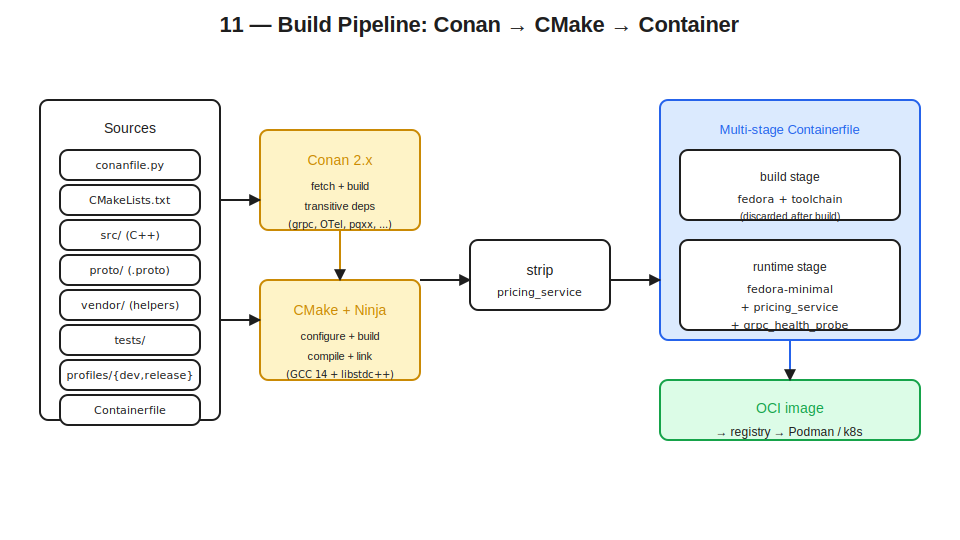

# 11 — Build Tooling Appendix: Conan, CMake, Toolchain



## Thesis

The earlier documents assumed a Conan + CMake + Ninja + GCC-or-Clang build environment. This appendix covers the specifics — which libraries to pull in, what versions, what compiler flags, how to wire the multi-stage container build, and full source for the small vendored helpers that earlier docs referenced. The treatment is reference-style; the goal is that a service team can use this as a checklist to set up a new C++ gRPC service in this stack.

The toolchain landscape moves quickly. C++23 features that were partial a year ago are landed; features that just landed need newer compiler versions than long-term-support distributions ship. This document calls out specific GCC and Clang versions where the feature dependency matters. Beyond that, the patterns are stable: Conan 2.x for dependencies, CMake 3.27+ for build configuration, Ninja as the generator, multi-stage Dockerfile or Containerfile for the image build, GCC 14+ for libstdc++'s C++23 support.

## Conan 2.x setup

A typical `conanfile.py` for a service in this stack:

```python
from conan import ConanFile
from conan.tools.cmake import CMakeDeps, CMakeToolchain, cmake_layout

class PricingService(ConanFile):
    name = "pricing"
    version = "1.0.0"
    settings = "os", "compiler", "build_type", "arch"
    requires = (
        # gRPC + protobuf
        "grpc/1.65.0",
        "protobuf/5.27.0",
        # Telemetry
        "opentelemetry-cpp/1.16.0",
        # Backing-service clients
        "libpqxx/7.9.0",
        "redis-plus-plus/1.3.13",
        "librdkafka/2.4.0",
        # Logging
        "spdlog/1.14.1",
        # Utility libraries
        "abseil/20240116.2",
        "boost/1.85.0",
        # gRPC + Asio bridge (header-only; pulled in via cmake_find_package)
        "asio-grpc/2.9.2",
        # JSON for config and structured logging support
        "nlohmann_json/3.11.3",
    )
    test_requires = (
        "gtest/1.14.0",
    )
    default_options = {
        "grpc/*:codegen": True,
        "grpc/*:cpp_plugin": True,
        "opentelemetry-cpp/*:with_otlp_grpc": True,
        "opentelemetry-cpp/*:with_stl": "CXX17",
        "boost/*:without_python": True,
        "boost/*:shared": False,
    }
    generators = ()  # generators handled in generate()

    def layout(self):
        cmake_layout(self)

    def generate(self):
        tc = CMakeToolchain(self, generator="Ninja")
        tc.variables["CMAKE_EXPORT_COMPILE_COMMANDS"] = "ON"
        tc.generate()
        deps = CMakeDeps(self)
        deps.generate()
```

The version pins are concrete; bumping them is a deliberate operation, tested in CI. The `default_options` flags select the relevant features — gRPC's protoc plugin for code generation, OTLP-over-gRPC for the OpenTelemetry exporter, Boost without Python (we don't need it), static Boost to keep the binary self-contained.

Two Conan profiles are useful — one for development (debug symbols, sanitizers, fast incremental rebuilds) and one for production builds (optimized, LTO, hardening flags):

```ini
# ~/.conan2/profiles/dev
[settings]
os=Linux
arch=x86_64
compiler=gcc
compiler.version=14
compiler.libcxx=libstdc++11
compiler.cppstd=23
build_type=RelWithDebInfo

[conf]
tools.cmake.cmaketoolchain:generator=Ninja
tools.build:cxxflags=["-fsanitize=address", "-fno-omit-frame-pointer"]
tools.build:linkflags=["-fsanitize=address"]
```

```ini
# ~/.conan2/profiles/release
[settings]
os=Linux
arch=x86_64
compiler=gcc
compiler.version=14
compiler.libcxx=libstdc++11
compiler.cppstd=23
build_type=Release

[conf]
tools.cmake.cmaketoolchain:generator=Ninja
tools.build:cxxflags=[
    "-O3",
    "-flto=auto",
    "-fstack-protector-strong",
    "-D_FORTIFY_SOURCE=2",
    "-fno-plt",
    "-fvisibility=hidden",
    "-fvisibility-inlines-hidden",
]
tools.build:linkflags=[
    "-flto=auto",
    "-Wl,-z,relro",
    "-Wl,-z,now",
    "-Wl,--gc-sections",
]
```

The dev profile turns on AddressSanitizer for development builds — catches arena lifetime bugs (Doc 03), the locks-across-`co_await` UB (Doc 05), and most of the resource-leak patterns. The release profile enables LTO and the standard set of hardening flags. `-fvisibility=hidden` reduces dynamic symbol table size, which helps both startup time (Doc 06) and security surface.

Invoking Conan:

```bash
conan install . --profile=dev --build=missing
cmake --preset=conan-relwithdebinfo
cmake --build --preset=conan-relwithdebinfo
```

The Conan-generated CMake presets (in `CMakeUserPresets.json`) wire the toolchain file automatically.

## Library inventory

Brief notes on each library — what it's for, what version is current, what to watch for.

**grpc + protobuf** are the canonical pair for gRPC C++. `grpc/1.65.0` (mid-2024) onward has solid callback API support. The `cpp_plugin` option enables `protoc-gen-cpp` for `.proto` compilation. The Conan recipe builds protobuf as a transitive dependency at a compatible version; trying to mix Conan-built and system-built protobuf typically ends badly.

**opentelemetry-cpp** is the C++ SDK for OTel. `with_otlp_grpc: True` enables the OTLP-over-gRPC exporter that talks to the OTel Collector. The library pulls in its own protobuf descriptors; ensure Conan resolves to the same protobuf version as gRPC uses. The `with_stl: "CXX17"` option (despite the name, it covers C++17 and later) uses standard-library types like `std::shared_ptr` in the API instead of the SDK's internal `nostd::*` types, which simplifies user code.

**libpqxx** is the C++ wrapper for libpq. As Doc 07 noted, it does not ship a connection pool; the `PgPool` class in Doc 07 fills the gap. `libpqxx/7.9.0` requires PostgreSQL 14+ on the server side.

**redis-plus-plus** is the C++ Redis client, layered over hiredis. `redis-plus-plus/1.3.13` covers Redis 6.x and 7.x. The bundled connection pool (Doc 07) is usable out of the box.

**librdkafka** is the C client; the bundled `cppkafka` or `modern-cpp-kafka` wrappers provide C++ idioms. Both are available via Conan recipes. Pin the client to a version compatible with the broker fleet (Kafka clients are generally backward-compatible to older brokers but forward-compatible only within a major version).

**spdlog** is the logging library (Doc 08). `spdlog/1.14.1` supports the structured-pattern formatting used in the Doc 08 example. The header-only mode is the default; the compiled mode (`header_only: False` option) reduces compile time for large codebases.

**abseil** provides `flat_hash_map`, `node_hash_map`, `Cord`, `Time`, and other utilities used across the doc set. Doc 04 mentioned `absl::flat_hash_map` as a denser alternative to `std::unordered_map` for process-scoped caches. Pin to a recent LTS release; Abseil's compatibility story is documented and reliable.

**boost** is used primarily for Asio (Doc 05) and optionally for Fiber (Doc 05). Build with `shared: False` to embed in the binary; build `without_python` to avoid pulling in Python dependencies that aren't needed.

**asio-grpc** is the coroutine bridge between gRPC's `CompletionQueue` and Boost.Asio's executor model (Doc 05, Doc 10). Header-only; pulled in via Conan's CMake find_package generation.

**nlohmann_json** is the standard JSON library for C++. Used for parsing configuration files that don't fit in env vars (rare, but useful for complex policies). Also useful for structured logging if spdlog's built-in patterns are insufficient.

**GoogleTest** as test framework, brought in via `test_requires`. Catch2 is an equally good alternative; pick one per project.

## CMake structure

A top-level `CMakeLists.txt` for the example:

```cmake
cmake_minimum_required(VERSION 3.27)
project(pricing
    VERSION 1.0.0
    DESCRIPTION "Order pricing service"
    LANGUAGES CXX)

# C++ standard. C++23 baseline; specific features check via __cpp_lib_*
set(CMAKE_CXX_STANDARD 23)
set(CMAKE_CXX_STANDARD_REQUIRED ON)
set(CMAKE_CXX_EXTENSIONS OFF)

# Dependencies from Conan
find_package(Protobuf  REQUIRED)
find_package(gRPC      REQUIRED)
find_package(opentelemetry-cpp REQUIRED)
find_package(libpqxx   REQUIRED)
find_package(redis-plus-plus REQUIRED)
find_package(spdlog    REQUIRED)
find_package(absl      REQUIRED)
find_package(Boost     REQUIRED COMPONENTS system thread context)
find_package(asio-grpc REQUIRED)
find_package(nlohmann_json REQUIRED)

# Vendored helpers
add_subdirectory(vendor/cgroup_helper)
add_subdirectory(vendor/psi_reader)
add_subdirectory(vendor/otel_propagator)

# Proto code generation
add_subdirectory(proto)

# Service binary
add_subdirectory(src)

# Tests
if(BUILD_TESTING)
    enable_testing()
    find_package(GTest REQUIRED)
    add_subdirectory(tests)
endif()
```

The `proto/CMakeLists.txt` generates C++ code from `.proto` files via gRPC's protoc plugin:

```cmake
set(PROTO_FILES
    pricing/v1/pricing.proto
    tax/v1/tax.proto
)

add_library(pricing_proto STATIC)
target_link_libraries(pricing_proto
    PUBLIC
        protobuf::libprotobuf
        gRPC::grpc++
)
target_include_directories(pricing_proto
    PUBLIC
        $<BUILD_INTERFACE:${CMAKE_CURRENT_BINARY_DIR}>
)

protobuf_generate(
    TARGET pricing_proto
    LANGUAGE cpp
    PROTOS ${PROTO_FILES}
)
protobuf_generate(
    TARGET pricing_proto
    LANGUAGE grpc
    GENERATE_EXTENSIONS .grpc.pb.h .grpc.pb.cc
    PLUGIN "protoc-gen-grpc=$<TARGET_FILE:gRPC::grpc_cpp_plugin>"
    PROTOS ${PROTO_FILES}
)
```

`src/CMakeLists.txt` for the service binary:

```cmake
add_executable(pricing_service
    main.cpp
    pricing_service.cpp
    request_context.cpp
    pg_pool.cpp
    channel_cache.cpp
    config.cpp
    signal_handler.cpp
)

target_link_libraries(pricing_service
    PRIVATE
        pricing_proto
        opentelemetry-cpp::api
        opentelemetry-cpp::sdk
        opentelemetry-cpp::otlp_grpc_exporter
        libpqxx::pqxx
        redis-plus-plus::redis-plus-plus
        spdlog::spdlog
        absl::base
        absl::flat_hash_map
        absl::strings
        absl::synchronization
        Boost::asio
        asio-grpc::asio-grpc
        nlohmann_json::nlohmann_json
        cgroup_helper
        psi_reader
        otel_propagator
)

# Compiler warnings.
target_compile_options(pricing_service PRIVATE
    -Wall -Wextra -Wpedantic
    -Wno-deprecated-declarations  # protobuf-generated code can be noisy
)

# Install paths for the container image.
install(TARGETS pricing_service RUNTIME DESTINATION bin)
```

The vendored helper subdirectories are small `OBJECT` or `STATIC` libraries that hold the cgroup reader, PSI parser, and OTel propagator — their full source is below.

## Toolchain and C++23 feature support

The compiler version controls which C++23 features are available. The table below covers the features called out across the doc set:

| Feature | Used in | GCC | Clang/libc++ |
|---|---|---|---|
| `std::expected` | Doc 02 | 12+ | 16+ |
| `<stacktrace>` | Doc 02, 08 | 14+ | 18+ (link `-lstdc++_libbacktrace`) |
| `std::pmr::stacktrace` | Doc 02, 03 | 14+ | 18+ |
| `std::print`, `std::println` | (optional) | 14+ | 18+ (partial) |
| `std::flat_map` / `std::flat_set` | Doc 03, 04 | 15+ | not yet (as of 2026) |
| `std::stop_token` / `std::jthread` | Doc 05, 09 | 10+ (C++20) | 13+ (C++20) |
| `std::generator` | (optional, coroutines) | 14+ | 19+ (partial) |
| `constinit` | Doc 06 | 10+ (C++20) | 11+ (C++20) |
| Designated initializers | Doc 03 | 8+ (C++20) | 10+ (C++20) |

For services that need `std::flat_map` today and don't have GCC 15+, the fallback is Abseil's `absl::flat_hash_map` (different semantics — hash table, not sorted) or `absl::btree_map` (sorted, b-tree, similar cache behaviour to `flat_map`). Both are stable and well-tested.

For services that need `<stacktrace>`, the link flag matters: GCC 14 ships `libstdc++_libbacktrace` as a separate static library that must be explicitly linked. Conan's CMake integration handles this when the standard library detects the feature, but it's worth knowing about for debugging "undefined reference to `std::stacktrace::...`" linker errors.

GCC 14 with libstdc++ on a glibc 2.35+ host is the recommended baseline as of 2026. Clang 18+ with libc++ works equivalently for most features, with the `flat_map` gap noted above. The dev/release profile examples above pin GCC 14 explicitly.

## Standard library choice

libstdc++ (GCC's standard library) and libc++ (Clang's standard library) differ in implementation details that occasionally matter for service code.

`std::string`'s small-string optimization (SBO) holds up to 15 bytes in libstdc++, up to 22 bytes in libc++ (Doc 02 mentioned this in the constructor-cost discussion). For services that handle many short identifiers, libc++'s SBO can produce measurable allocation savings.

`std::unordered_map`'s implementation differs: libstdc++ uses bucket-array-of-singly-linked-lists; libc++ uses a similar approach with different load factor defaults. For high-cardinality maps, `absl::flat_hash_map` outperforms both consistently.

`std::regex` is slow in both implementations (the standard's specification effectively prohibits the optimizations modern regex engines use). For regex-heavy workloads, `boost::regex` or `re2` are dramatically faster.

For most services, libstdc++ with GCC is the default. The Conan profile sets `compiler.libcxx=libstdc++11`; switching to Clang means rebuilding all dependencies against libc++, which is a longer compile but well-supported by Conan.

## Building for containers

The recommended Containerfile pattern is multi-stage: a build stage with the full toolchain and dependencies, a runtime stage with only the binary and its runtime needs.

```dockerfile
# syntax=docker/dockerfile:1.7

# --- Build stage ---
FROM registry.fedoraproject.org/fedora:40 AS build

RUN dnf install -y --setopt=install_weak_deps=False \
    gcc-c++ cmake ninja-build python3-pip git \
    && pip3 install conan==2.5.0 \
    && dnf clean all

WORKDIR /src
COPY conanfile.py conanfile.txt* ./
COPY proto/ proto/
COPY src/ src/
COPY vendor/ vendor/
COPY CMakeLists.txt ./
COPY profiles/ profiles/

RUN conan profile detect \
    && cp profiles/release ~/.conan2/profiles/release \
    && conan install . --profile=release --build=missing

RUN cmake --preset=conan-release \
    && cmake --build --preset=conan-release --target=pricing_service

RUN strip build/Release/bin/pricing_service

# --- Runtime stage ---
FROM registry.fedoraproject.org/fedora-minimal:40 AS runtime

# grpc_health_probe for the container HEALTHCHECK directive.
ARG GRPC_HEALTH_PROBE_VERSION=v0.4.24
RUN curl -fsSL -o /usr/local/bin/grpc_health_probe \
    https://github.com/grpc-ecosystem/grpc-health-probe/releases/download/${GRPC_HEALTH_PROBE_VERSION}/grpc_health_probe-linux-amd64 \
    && chmod +x /usr/local/bin/grpc_health_probe

# Runtime libraries the binary links against dynamically.
RUN microdnf install -y libstdc++ ca-certificates \
    && microdnf clean all

# Service binary.
COPY --from=build /src/build/Release/bin/pricing_service /usr/local/bin/

# Non-root user (matches the Kubernetes runAsUser from Doc 10).
RUN useradd --uid 1000 --no-create-home --shell /sbin/nologin service
USER 1000

EXPOSE 50051
ENTRYPOINT ["/usr/local/bin/pricing_service"]
```

A few choices to call out. The build stage uses the full Fedora image; the runtime stage uses `fedora-minimal` which is much smaller. The binary is stripped after build to remove debug symbols (production debugging uses separate symbol files shipped to a symbol server, not symbols in the running image). `grpc_health_probe` comes from the gRPC ecosystem's prebuilt binary release — adding a few MB to the image, far less than building it from source.

The `USER 1000` directive matches the `runAsUser: 1000` from the Kubernetes manifest in Doc 10. Running as a non-root UID inside the container is independent of the rootless-Podman story (Doc 08) but layers on the same defense-in-depth.

For a smaller image, switch the runtime base to `distroless` (Google's stripped-down image) or build a static binary against musl libc and use `scratch` as the base. The trade-off is that distroless and scratch images are harder to debug interactively; for a development-side compose file, the full Fedora image is more friendly.

## Vendored helpers

Three small helpers were referenced across the doc set but never shown in full. They live under `vendor/` and are built as small static libraries.

### `vendor/cgroup_helper/`

The cgroup CPU limit reader from Doc 05.

```cpp
// cgroup_helper.h
#pragma once
#include <optional>

namespace cgroup_helper {

// Returns the CPU limit in cores (e.g., 0.5 for half a CPU, 2.0 for two CPUs).
// Returns std::nullopt if running unconstrained or detection failed.
std::optional<double> cpu_limit_cores();

// Returns the memory limit in bytes, or std::nullopt if unbounded.
std::optional<std::size_t> memory_limit_bytes();

// Returns true if the process appears to be running inside a container.
bool in_container();

}  // namespace cgroup_helper
```

```cpp
// cgroup_helper.cpp
#include "cgroup_helper.h"

#include <fstream>
#include <sched.h>
#include <string>

namespace cgroup_helper {

namespace {

std::optional<double> read_cgroup_v2() {
    std::ifstream f{"/sys/fs/cgroup/cpu.max"};
    if (!f) return std::nullopt;
    std::string max_str;
    long period{};
    if (!(f >> max_str >> period)) return std::nullopt;
    if (max_str == "max" || period <= 0) return std::nullopt;
    try {
        return std::stol(max_str) / static_cast<double>(period);
    } catch (...) {
        return std::nullopt;
    }
}

std::optional<double> read_cgroup_v1() {
    long quota{}, period{};
    {
        std::ifstream qf{"/sys/fs/cgroup/cpu/cpu.cfs_quota_us"};
        if (!qf || !(qf >> quota)) return std::nullopt;
    }
    {
        std::ifstream pf{"/sys/fs/cgroup/cpu/cpu.cfs_period_us"};
        if (!pf || !(pf >> period)) return std::nullopt;
    }
    if (quota <= 0 || period <= 0) return std::nullopt;
    return quota / static_cast<double>(period);
}

std::optional<double> read_affinity() {
    cpu_set_t set;
    CPU_ZERO(&set);
    if (sched_getaffinity(0, sizeof(set), &set) != 0) return std::nullopt;
    return static_cast<double>(CPU_COUNT(&set));
}

}  // namespace

std::optional<double> cpu_limit_cores() {
    if (auto v = read_cgroup_v2()) return v;
    if (auto v = read_cgroup_v1()) return v;
    return read_affinity();
}

std::optional<std::size_t> memory_limit_bytes() {
    std::ifstream f{"/sys/fs/cgroup/memory.max"};
    if (!f) {
        f.open("/sys/fs/cgroup/memory/memory.limit_in_bytes");
        if (!f) return std::nullopt;
    }
    std::string s;
    if (!(f >> s)) return std::nullopt;
    if (s == "max") return std::nullopt;
    try {
        const auto v = std::stoull(s);
        // cgroup v1 returns a huge sentinel for "unlimited"; treat as max.
        if (v > (1ULL << 60)) return std::nullopt;
        return v;
    } catch (...) { return std::nullopt; }
}

bool in_container() {
    std::ifstream f{"/proc/1/cgroup"};
    if (!f) return false;
    std::string line;
    while (std::getline(f, line)) {
        if (line.find("/docker/") != std::string::npos) return true;
        if (line.find("/kubepods") != std::string::npos) return true;
        if (line.find(".scope") != std::string::npos) return true;
        if (line.find("containerd") != std::string::npos) return true;
    }
    return false;
}

}  // namespace cgroup_helper
```

```cmake
# vendor/cgroup_helper/CMakeLists.txt
add_library(cgroup_helper STATIC cgroup_helper.cpp)
target_include_directories(cgroup_helper PUBLIC ${CMAKE_CURRENT_SOURCE_DIR})
```

### `vendor/psi_reader/`

The PSI parser from Doc 05's sidebar. Brief because it's straightforward — read the file, parse three `avgN=X.XX` fields:

```cpp
// psi_reader.h
#pragma once
#include <optional>
#include <string_view>

namespace psi_reader {

struct Pressure {
    double avg10  = 0.0;
    double avg60  = 0.0;
    double avg300 = 0.0;
    double total  = 0.0;
};

// Resource is "cpu", "memory", or "io".
// path_prefix is "/proc/pressure" (system-wide) or
// "/sys/fs/cgroup/{path}" (cgroup-scoped).
std::optional<Pressure> read_some(std::string_view resource,
                                  std::string_view path_prefix = "/proc/pressure");

std::optional<Pressure> read_full(std::string_view resource,
                                  std::string_view path_prefix = "/proc/pressure");

}  // namespace psi_reader
```

The `.cpp` implementation reads the file, parses the `some` or `full` line into the `Pressure` struct, returns `nullopt` on parse failure. Full source is mechanical; the pattern is shown enough above for re-implementation.

### `vendor/otel_propagator/`

The trace-context propagator used in Doc 10's `compute_tax`. The OTel C++ SDK provides the underlying machinery; this is a thin wrapper that adapts to a `grpc::ClientContext`:

```cpp
// otel_propagator.h
#pragma once
#include <grpcpp/client_context.h>

namespace otel_propagator {

// Injects the current active span's W3C TraceContext headers
// into the gRPC ClientContext's metadata.
void inject_into(grpc::ClientContext& client_ctx);

// Extracts trace context from a ServerContext's metadata, returning
// a Context that can be used to start a child span correlated to
// the caller's trace.
opentelemetry::context::Context extract_from(
    const grpc::ServerContext& server_ctx);

}  // namespace otel_propagator
```

```cpp
// otel_propagator.cpp (excerpt)
#include "otel_propagator.h"

#include <opentelemetry/context/propagation/global_propagator.h>
#include <opentelemetry/context/propagation/text_map_propagator.h>
#include <opentelemetry/context/runtime_context.h>

namespace otel = opentelemetry;

namespace {

struct GrpcMetadataInjector
    : public otel::context::propagation::TextMapCarrier {
    grpc::ClientContext& ctx;
    explicit GrpcMetadataInjector(grpc::ClientContext& c) : ctx{c} {}
    void Set(otel::nostd::string_view key,
             otel::nostd::string_view value) noexcept override {
        ctx.AddMetadata(std::string{key.data(), key.size()},
                        std::string{value.data(), value.size()});
    }
    otel::nostd::string_view Get(otel::nostd::string_view) const noexcept override {
        return {};  // not used for injection
    }
};

}  // namespace

namespace otel_propagator {

void inject_into(grpc::ClientContext& client_ctx) {
    auto propagator =
        otel::context::propagation::GlobalTextMapPropagator::GetGlobalPropagator();
    GrpcMetadataInjector carrier{client_ctx};
    propagator->Inject(carrier, otel::context::RuntimeContext::GetCurrent());
}

// extract_from() is symmetric with a Getter-implementing carrier reading
// from server_ctx.client_metadata(). Omitted here for brevity.

}  // namespace otel_propagator
```

The OTel SDK does the heavy lifting of building W3C-conformant headers (`traceparent`, `tracestate`); this wrapper plugs it into gRPC's metadata-injection API. Both directions (inject for outbound RPCs, extract for inbound) are needed for a complete tracing pipeline.

## Test infrastructure

A `tests/` subdirectory with GoogleTest:

```cmake
# tests/CMakeLists.txt
add_executable(unit_tests
    test_request_context.cpp
    test_pg_pool.cpp
    test_channel_cache.cpp
    test_idempotency.cpp
)

target_link_libraries(unit_tests
    PRIVATE
        pricing_proto
        # plus everything the service depends on
        GTest::gtest
        GTest::gtest_main
        spdlog::spdlog
        # ...
)

include(GoogleTest)
gtest_discover_tests(unit_tests)
```

For backing-service-dependent tests (PgPool, Redis access), the standard pattern is to spin up the dependency in a sidecar container during the test run — testcontainers-cpp is the C++ equivalent of the Java testcontainers library and integrates with Conan via its own recipe. Alternatively, run the test container under podman-compose and have the test binary connect to it.

For unit tests of pure C++ code — the `RequestContext` lifecycle, `ChannelCache` insertion logic, idempotency key handling — GoogleTest is sufficient on its own. Mock the gRPC and backing-service interfaces at the seam, test the logic in isolation.

## Common gotchas

A short list of build-tooling traps that catch people the first time.

The Conan-generated `find_package` files live in the build directory, not in a system path. CMake must be invoked with the Conan-generated preset (or with `CMAKE_TOOLCHAIN_FILE` pointing to the Conan-generated toolchain file). Running `cmake ..` without the Conan toolchain produces "could not find Package" errors that look mysterious.

The protobuf and gRPC versions must match across Conan dependencies. If two libraries pull in different protobuf versions transitively, the build fails with linker errors that mention duplicate symbols in the protobuf runtime. Pin protobuf explicitly in `conanfile.py` to the version that matches your gRPC choice.

GCC's libstdc++ ABI changed in GCC 5 (the "dual ABI" transition). Conan profiles set `compiler.libcxx=libstdc++11` for the new ABI; the legacy `libstdc++` value is for old ABI. Mixing libraries built with different ABI settings produces link errors and runtime crashes that look like memory corruption. Always use `libstdc++11` for new builds.

`-flto=auto` requires `gcc-plugin-devel` and matching linker support; with mismatched versions, LTO silently fails to produce optimized output. Verify with `nm -C` on the resulting binary that section sizes are reduced and that template instantiations are deduplicated.

`-fvisibility=hidden` interacts with shared-library boundaries; for templates that need to be instantiated across translation units (gRPC's generated code, protobuf's reflection types), explicit `__attribute__((visibility("default")))` may be required on a small number of symbols. The Conan recipes for grpc and protobuf handle this internally; user code rarely needs to.

The Containerfile multi-stage pattern requires the build stage and runtime stage to use compatible glibc versions. Building on Fedora 40 (glibc 2.39) and running on Fedora 38 (glibc 2.37) usually works because of glibc's backward compatibility, but the reverse — building on an older glibc, running on a newer one — is fine, and building on a newer glibc, running on an older one — may produce missing-symbol errors at startup. Default to building and running on the same major distro release.

## Recommendation summary

Use Conan 2.x with `conanfile.py` for explicit version pins on every dependency. Maintain separate dev and release profiles. Rebuild via Conan when changing compiler flags, not by hand-editing `CMakeCache.txt`.

Use CMake 3.27+ with Ninja as the generator and Conan-generated presets for invocation. Standardize on `cmake --preset=conan-{release,relwithdebinfo}` as the documented build commands.

Pin to GCC 14 with libstdc++ for C++23 support breadth. Switch to Clang 18+ with libc++ only when there's a specific reason; the developer ergonomics are equivalent but the Conan rebuild cost is real.

Use multi-stage Containerfiles. Build stage with full toolchain, runtime stage with minimal base plus the stripped binary and `grpc_health_probe`. Match the runtime user UID to the Kubernetes `runAsUser`.

Vendor small helpers (cgroup detection, PSI parsing, OTel context propagation) under `vendor/` as Conan-free static libraries. They have minimal dependencies and don't justify the overhead of separate packages.

Wire AddressSanitizer in the dev profile. Most arena lifetime bugs, RAII inversions, and `co_await` UB cases that the prior documents warned about surface immediately under ASan, before they reach production.

Test with GoogleTest (or Catch2) for unit tests. Use testcontainers-cpp or podman-compose for backing-service integration tests. Run both in CI.

## Cross-references

Doc 02 referenced `std::expected` and `std::pmr::stacktrace` (C++23). The toolchain table in this document covers the GCC/Clang version requirements.

Doc 03 referenced `std::flat_map` (C++23). Until libstdc++ GCC 15 / libc++ catches up, Abseil's `flat_hash_map` or `btree_map` is the fallback.

Doc 04 referenced the cgroup-detection helper. Full source in this document under `vendor/cgroup_helper/`.

Doc 05 referenced the PSI reader as a sidebar helper. Full interface in this document under `vendor/psi_reader/`.

Doc 06 covered the C++ startup tax and `constinit`; the toolchain table in this document confirms the version requirements.

Doc 07 referenced the backing-service Conan recipes. This document lists them in the library inventory.

Doc 08 referenced spdlog configuration for stdout logging. This document covers the Conan recipe and CMake wiring.

Doc 09 referenced `grpc_health_probe` for the `HEALTHCHECK` directive. The Containerfile in this document shows the install step.

Doc 10 referenced the OTel context propagator. Full source in this document under `vendor/otel_propagator/`.

## Annotated bibliography

**Conan 2 documentation (`docs.conan.io`).** The reference for `conanfile.py` syntax, profile management, and CMake integration. Worth reading the migration-from-1.x section if you have a v1 codebase.

**CMake documentation (`cmake.org/cmake/help/latest/`).** The `cmake.tools.cmake.cmaketoolchain` and `cmake.tools.cmake.cmakedeps` Conan generators are documented under the CMake side as well; reading both sides clarifies which tool owns what.

**GCC release notes for versions 12, 13, 14, 15.** Each release adds C++23 features; the release notes are the authoritative source for "which version has what." Linked from `gcc.gnu.org/projects/cxx-status.html` (and `libstdc++.html` for the standard-library side).

**Clang C++ Status (`clang.llvm.org/cxx_status.html`) and libc++ status (`libcxx.llvm.org/Status/Cxx23.html`).** The Clang/libc++ counterpart of GCC's pages. Useful for cross-checking feature availability.

**OCI Image Specification (`github.com/opencontainers/image-spec`).** Background reading for the Containerfile pattern; understanding the layered image model informs decisions about what goes in build stages vs runtime stages.

**The gRPC ecosystem `grpc_health_probe` repository (`github.com/grpc-ecosystem/grpc-health-probe`).** Documentation for the health-probe binary used in the Containerfile. The releases page is where the prebuilt binary comes from.

**Google's "Software Engineering at Google" (Winters, Manshreck, Wright).** Not directly about C++ build tooling, but the chapters on dependency management and on build systems frame the Conan-vs-system-packages tradeoffs that this document operationalizes.

**Iglberger, *C++ Software Design*.** The chapters on the build system and on physical architecture inform the CMake structure shown above — header organization, library boundaries, public-vs-private dependencies via CMake's `PUBLIC`/`PRIVATE` keywords.
